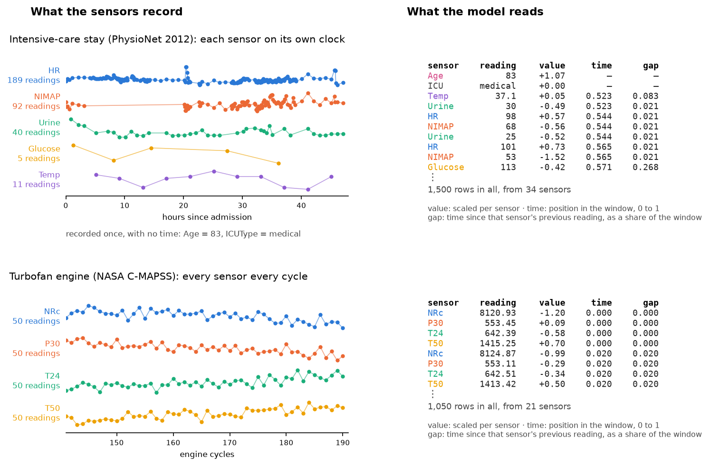

# Emblema

[](https://github.com/lstasiak/emblema/actions/workflows/ci.yml)
[](https://htmlpreview.github.io/?https://github.com/lstasiak/emblema/blob/python-coverage-comment-action-data/htmlcov/index.html)
[](https://www.python.org/)
[](https://github.com/astral-sh/uv)
[](https://github.com/astral-sh/ruff)
[](https://github.com/astral-sh/ty)
[](https://mypy-lang.org/)
[](https://import-linter.readthedocs.io/)
[](https://github.com/pre-commit/pre-commit)
[](LICENSE)

Emblema is a research platform for label-efficient representation learning on heterogeneous
sensor streams. One permutation-invariant, variable-channel transformer is pretrained without
labels on corpora that differ in channel count and sampling regime. It is then adapted to small
labelled tasks. The platform measures, with paired confidence intervals and tuned classical
baselines, whether and when that pretraining pays off. It can serve whichever candidate a
finished comparison measured.

## The name

In a Roman mosaic the *emblema* is the central panel. It was laid in a workshop from the finest
tesserae, then carried to the site and set into a floor of coarser tiles. The pretrained core
here is made once, over many corpora, and carried into new arrangements of sensors. Each
measurement is a *tessera*: a self-contained token of channel, time and value.


*Emblema with Pegasus, second century AD, Archaeological Museum of Córdoba. Photograph by
[Carole Raddato](https://commons.wikimedia.org/wiki/File:Mosaic_emblema_with_Pegasus,_the_immortal_winged_horse_which_sprang_forth_from_the_neck_of_Medusa_when_she_was_beheaded_by_the_hero_Perseus,_2nd_century_AD,_Archaeological_Museum_of_C%C3%B3rdoba,_Spain_(24783223879).jpg),
[CC BY-SA 2.0](https://creativecommons.org/licenses/by-sa/2.0/), via Wikimedia Commons; scaled down.*

## How it works

**The problem.** Industrial and scientific sensor data rarely looks like a neat table. A jet
engine reports 21 sensors every cycle. An intensive-care patient has a heart rate every few
minutes, a blood test twice a day, and some values never measured at all. A satellite sends
telemetry in bursts with gaps between passes. Most time-series models expect a fixed set of
channels sampled on a regular clock. So each new dataset is usually resampled onto a grid, filled
in where values are missing, and given a model of its own trained from its own labels. Labels are
the expensive part: someone has to record when each engine failed or how each patient's stay
ended.

**The idea.** Train one model on many unlabelled sensor datasets first, then adapt it to a new
task with only a few labels. This is what pretrained language models do for text. For it to work
across datasets, the model must not care how many sensors a dataset has or how often they are
read.

**Measurements as a bag of tokens.** Each measurement becomes one token: which sensor, its value
(scaled per sensor), and when it was taken within the window. A token also carries how long it
has been since that sensor's previous reading. A window of data is simply the set of its tokens.
Three sensors or thirty, read every second or twice a day, it is the same kind of input, with
nothing interpolated and no invented values. Fixed facts, such as a patient's age, become tokens
without a time.



*Real data, tokenised by the code in this repository. Top: 48 hours of one intensive-care stay
(PhysioNet 2012), where heart rate is read 189 times and glucose 5. Bottom: the last 50 cycles of
one turbofan engine (NASA C-MAPSS), every sensor every cycle. On the right, the rows the model
receives for each: the same kind of input, of any length, from any sensors.*

**One encoder for any sensor set.** A transformer reads the whole set at once. Each sensor has a
learned identity vector, so a sensor it has never seen gets a new vector learned from a little
data, while everything else carries over. The order of the tokens does not matter.

**Learning without labels.** During pretraining, parts of each window are hidden: whole sensors,
stretches of one sensor's time, or single readings. The model must predict the hidden values from
what remains. Each kind of gap is also filled by a simple method, such as straight-line
interpolation or a linear regression on the other sensors. The model counts as having learnt
something only where it beats that method.

**Adapting to a task.** The pretrained encoder is then used four ways on a small labelled task:
kept frozen with only a small output layer trained, lightly adjusted through a few extra weights
(LoRA), fully fine-tuned, or trained from scratch as the control. Each is run at several label
budgets, from 50 labelled windows to all of them.

**Keeping the comparison honest.**

- **Rules first.** The comparisons, the size of an improvement that counts, and what is reported
  if the answer is no are written down and committed before the runs they judge
  ([`docs/preregistration.md`](docs/preregistration.md)).
- **Engines, not windows.** Intervals are computed over engines or patients, the units that are
  independent, not over overlapping windows.
- **Strong baselines.** Classical methods compete in the same grid: gradient-boosted trees on
  window statistics, frequency features and MiniRocket. They are tuned by a declared procedure,
  so "a few hundred trees would have done as well" can be checked rather than argued.
- **A positive control.** A generated dataset with known shared structure checks that the
  pipeline can find structure when it is there. This makes a negative result on real data
  meaningful.

## Status

Preliminary, on validation data. Each task's test data is used once, at the end.

On the first task, remaining useful life of turbofan engines (NASA C-MAPSS), pretraining helps
where labels are scarce. With 200 labelled windows, fine-tuning the pretrained encoder lowers the
error by 12 % against the same network trained from scratch, and by 16–22 % with 50 labelled
windows. With every label available the advantage disappears.

Tuned classical methods are still stronger on this task: gradient-boosted trees reach 13.9 cycles
of error at 200 labels, against 16.1 for the best pretrained variant. The two numbers come from
separate runs. A single paired comparison of all candidates is the next step.

Numbers, intervals and limitations: [`docs/findings.md`](docs/findings.md).


*Error of each way of using the pretrained encoder, by number of labelled windows, on C-MAPSS
FD001. Top: validation error in cycles (lower is better). Bottom: the reduction against training
from scratch, with its 95 % interval over engines. Classical baselines are not shown; at 200
labels the best of them reaches 13.9. Colab A100, fp32; validation, not test.*

## Quickstart

Requires [uv](https://docs.astral.sh/uv/) and Python 3.12+. The floor is the Python of the free
GPU platforms.

```sh
uv sync --all-extras
uv run pytest                    # unit, domain and application tests
uv run lint-imports              # architecture contracts
```

### Local stack

Postgres, Garage, MLflow and RabbitMQ run in Docker:

```sh
cp env.example .env
docker compose up -d --wait
bash scripts/smoke.sh
uv run alembic upgrade head
uv run pytest -m integration     # adapter contracts against the stack
```

The integration tests use their own database, named after the configured one with `_test`
appended. The merge gate is the same suite inside the image, on the interpreter, wheels and OS
the processes run on:

```sh
docker compose run --rm tests pytest -o addopts="-ra --strict-markers" --cov
```

MPS-gated tests skip in the image, so the suite also runs on the development Mac. On macOS the
XGBoost tests run in a process of their own, because its OpenMP runtime cannot share a process
with torch's:

```sh
uv run pytest tests/evaluation/adapters/xgboost \
              tests/evaluation/adapters/test_classical_runtime_contract.py
```

`uv run --env-file .env.r2 pytest -m integration` runs the same contracts against the remote
bucket. The variable names are in `env.example`.

### Workflow

**Data.** Download from the sources of record, count, and publish a corpus as a block of windows
beside a manifest:

```sh
uv run scripts/fetch_corpora.py
uv run python -m emblema.entrypoints.cli.publish_corpus --corpus cmapss --window 50 --stride 5
```

**Pretraining.** Order a run here, run it on any machine with a GPU, then accept the result
against the order ([ADR-0024](docs/adr/0024-handing-a-run-to-another-machine.md)):

```sh
uv run python -m emblema.entrypoints.cli.pretrain order \
    --experiment experiments/<file>.toml --corpus <manifest key> <checksum> --run <name>
uv run python -m emblema.entrypoints.cli.pretrain run --order <key> <checksum>
uv run python -m emblema.entrypoints.cli.pretrain accept --result <key> <checksum> \
    --track http://127.0.0.1:5000
```

Every parameter of a run is in its experiment file under `experiments/`.

**Evaluation.** A campaign is declared from a committed file under `campaigns/`. Its cells run
either on the Celery workers or, where no broker is reachable, from an order in the artifact
store:

```sh
uv run python -m emblema.entrypoints.cli.campaign define-task --corpus <key> <checksum> --task turbofan-fd001
uv run python -m emblema.entrypoints.cli.campaign define --file campaigns/baselines-fd001.toml --task <task id>

# either through the queue
docker compose --profile workers up -d worker-ml worker-general
uv run python -m emblema.entrypoints.cli.campaign advance --campaign <id>

# or through an order, run anywhere and accepted back
uv run python -m emblema.entrypoints.cli.campaign order --campaign <id> --pool ml
uv run python -m emblema.entrypoints.cli.campaign_run --order <key> <checksum>
uv run python -m emblema.entrypoints.cli.campaign accept --result <key> <checksum>
```

A finished selection campaign reports its chosen variants with
`campaign select --campaign <id> --candidate <name>`. A closed campaign's announcement is
repeated with `campaign announce --campaign <id>`, which prints the checksum of every kept
artifact.

**Serving.** Only an artifact a finished campaign kept can be promoted, by checksum
([ADR-0037](docs/adr/0037-promoting-what-a-campaign-kept.md)):

```sh
uv run python -m emblema.entrypoints.cli.serving promote --checksum <checksum>
uv run python -m emblema.entrypoints.cli.serving withdraw --model <model id>
```

## Documentation

| Where | What |
| --- | --- |
| [`docs/findings.md`](docs/findings.md) | Results, setup and limitations on one page |
| [`docs/preregistration.md`](docs/preregistration.md) | Rules and configuration in force, with a register of every change |
| [`docs/adr/`](docs/adr/README.md) | Architecture decision records |
| [`docs/verification/`](docs/verification/README.md) | Dated measurement notes: the lab notebook |
