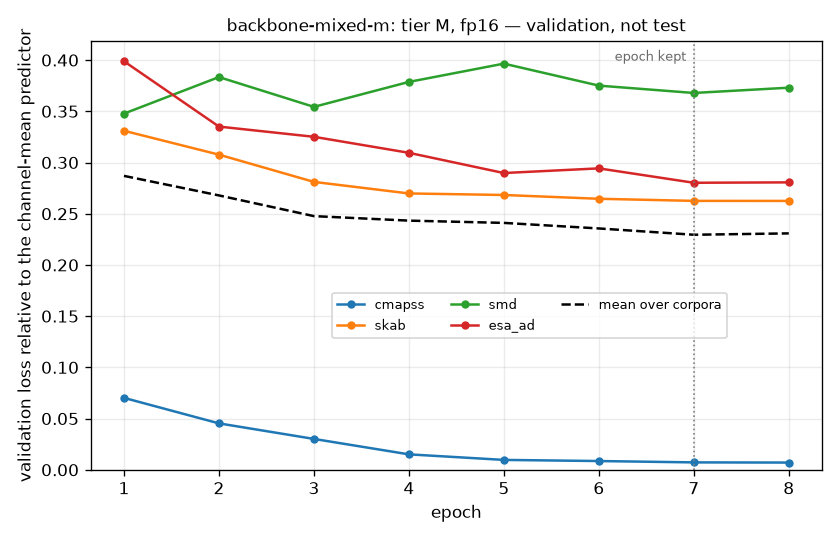

# Emblema

[](https://github.com/lstasiak/emblema/actions/workflows/ci.yml)
[](https://htmlpreview.github.io/?https://github.com/lstasiak/emblema/blob/python-coverage-comment-action-data/htmlcov/index.html)
[](https://www.python.org/)
[](https://github.com/astral-sh/uv)
[](https://github.com/astral-sh/ruff)
[](https://github.com/astral-sh/ty)
[](https://mypy-lang.org/)
[](https://import-linter.readthedocs.io/)
[](https://github.com/pre-commit/pre-commit)
[](LICENSE)

> **Work in progress.** The project is under active development. This README will be completed once the implementation is finished.

Emblema is a research platform for label-efficient representation learning on heterogeneous sensor streams. A single permutation-invariant, variable-channel transformer encoder is pretrained without labels on measurement corpora that differ in channel count and sampling regime, then transferred to new, small labelled tasks. The platform measures, with confidence intervals and strong classical baselines, whether and when that pretraining actually pays off, and serves the winning candidate through an API.

## The name

In a Roman mosaic the *emblema* is the central figurative panel: laid in a workshop from the
finest tesserae, then carried to the site and set into a floor of coarser tiles. The pretrained
core here is made once, over many corpora, and carried into new arrangements of sensors. A
single measurement stays a *tessera*: a self-contained token of channel, time and value, and the
model learns to see the whole from them.


*Emblema with Pegasus, second century AD, Archaeological Museum of Córdoba. Photograph by
[Carole Raddato](https://commons.wikimedia.org/wiki/File:Mosaic_emblema_with_Pegasus,_the_immortal_winged_horse_which_sprang_forth_from_the_neck_of_Medusa_when_she_was_beheaded_by_the_hero_Perseus,_2nd_century_AD,_Archaeological_Museum_of_C%C3%B3rdoba,_Spain_(24783223879).jpg),
[CC BY-SA 2.0](https://creativecommons.org/licenses/by-sa/2.0/), via Wikimedia Commons; scaled down.*

## Results so far

Everything below is preliminary and measured on the validation side; the frozen test side of every
task is opened once, at the end. Each figure names the compute tier and the hardware it was made
on.

### Label efficiency

The claim the programme tests is that the pretrained encoder lowers the number of labels a task
needs. The first reading is the turbofan task under four transfer modes over four budgets of
labelled windows and five seeds, judged by the rules registered before any of its numbers
existed ([`docs/preregistration.md`](docs/preregistration.md)): the endpoint is full fine-tuning
against training from scratch at 200 labelled windows, at least a tenth off the error with the
whole paired interval over engines above zero and the reduction clearing a practical floor.

**Not confirmed.** Full fine-tuning takes 21 % off the control's error at 200 windows (7.2 RMSE,
interval [5.9, 8.6]), but the floor at that budget is 7.25: the control arm leaves the plateau
of the mean predictor under two seeds of five and stays on it under three, so the reduction is
mostly a difference in how often thirty epochs get an arm off the plateau. The one cell that
clears its floor by a margin is the low-rank arm at 200 windows, whose five repeats all leave
the plateau (22.3 ± 1.4 against 32.8 ± 7.3). Beyond a thousand labels the arm trained from
scratch is the best one, and the frozen probe is far below every other arm at every budget.
Thirty epochs give a cell about twice as many optimiser steps as it has labels, so no cell had
converged when it was scored and the low budgets measure the speed of leaving the plateau as
much as the labels; a budget stated in steps is the first correction of the next run. The
synthetic control decides what this says about the encoder
([ADR-0030](docs/adr/0030-transfer-modes.md),
[ADR-0032](docs/adr/0032-statistics-of-a-paired-comparison.md),
[`docs/verification/label-efficiency-curve.md`](docs/verification/label-efficiency-curve.md)).


*Tier M, Kaggle T4, fp32. Preliminary; validation, not test.*

### The first backbone over a mixture of corpora

The first backbone over the mixture — C-MAPSS, SKAB, SMD and the satellite corpus under one
vocabulary, the reference shape of 4.75 million encoder parameters, eight epochs on a Kaggle T4
in half precision — keeps its seventh epoch. Every corpus is learnt under the mixture; SMD is the
one whose held-out loss rises while the mean still falls, which is the first thing the next run
of the mixture weighs ([ADR-0029](docs/adr/0029-pretraining-over-a-mixture-of-corpora.md),
[`docs/verification/manual-handoff.md`](docs/verification/manual-handoff.md)).



*Tier M, Kaggle T4, fp16. Validation, not test.*

## Methodology

The criteria that decide whether pretraining paid off — which comparison is primary, how large a
difference has to be, what is reported when the answer is partial or negative — are registered in
[docs/preregistration.md](docs/preregistration.md) before the runs they judge. Decisions about the
system are recorded in [docs/adr](docs/adr); measurements that cannot run in CI are dated notes in
[docs/verification](docs/verification).

A pretrained backbone meets a task in one of four ways, and the curve compares them at each label
budget: trained from scratch, frozen under a linear probe, fine-tuned through low-rank updates
(LoRA), fine-tuned in full. LoRA is not there to save memory or time — on an encoder of five
million parameters full fine-tuning is cheap — but as an ablation of regularisation: what happens
when fifty labels may spend fewer degrees of freedom. Every mode answers through the same linear
head, trains for a fixed number of epochs and is scored on the last, so no validation number
decides when a run stops ([ADR-0030](docs/adr/0030-transfer-modes.md)).

## Development

Requires [uv](https://docs.astral.sh/uv/). One command builds the environment, a second runs the tests:

```sh
uv sync --all-extras
uv run pytest
```

Supported Python: 3.12 and newer. The floor is set by the free GPU platforms the training code runs on.

Architecture rules (framework-free core, inward-pointing layers, bounded contexts that share only published contracts) are [import-linter](https://import-linter.readthedocs.io/) contracts in `pyproject.toml`. `uv run lint-imports` checks them; CI enforces them alongside lint, types and coverage.

### Local environment

Postgres, an S3-compatible artifact store ([Garage](https://garagehq.deuxfleurs.fr/)) and MLflow run in Docker. One command brings the stack up, a second checks it, a third creates the application's tables, a fourth runs the adapter contracts against it:

```sh
cp env.example .env
docker compose up -d --wait
bash scripts/smoke.sh
uv run alembic upgrade head
uv run pytest -m integration
```

The metadata database holds one schema per bounded context and one [Alembic](https://alembic.sqlalchemy.org/) migration tree for all of them (`migrations/`); `uv run alembic check` reports any table the model has and the migrations do not. The integration tests never write to the configured database: they create, migrate and empty one of their own, named after it with `_test` appended, so a registry with work in progress survives a test run.

The artifact store speaks S3 to Garage locally and to a Cloudflare R2 bucket that GPU platforms can reach. The same contract tests run against the remote bucket by configuration alone: `uv run --env-file .env.r2 pytest -m integration` (variables in `env.example`). `docker compose down -v` removes the stack and its data.

### Data

The raw corpora come from their sources of record into `data/raw/` (not tracked) and are priced before any tokeniser exists: units, windows and tokens are counted from the files, and the GPU-hour budget per compute tier is derived from `scripts/corpus_budget.toml` and the tier profiles in `src/emblema/config/compute_tiers.toml`. The satellite telemetry ships as pandas pickles, so reading it needs the `corpora` extra, which `--all-extras` installs.

```sh
uv run scripts/fetch_corpora.py            # about 12 GB; a re-run skips what is already there
uv run scripts/corpus_facts.py             # counts, printed as TOML to paste into the budget file
uv run scripts/corpus_budget_report.py     # the budget tables
```

A corpus is published once, as a block of token windows beside a manifest in the artifact store;
the manifest's reference is what a training run is pointed at:

```sh
uv run python -m emblema.entrypoints.cli.publish_corpus --corpus cmapss --window 50 --stride 5
```

### Pretraining

A run is made in three steps that may happen on two machines. The first registers the backbone
and places an order in the artifact store; the second fulfils the order wherever there is a GPU,
here or in a notebook that installed the package at the commit the order names; the third takes
the result back, holds it to the order, records the run in MLflow and registers the weights.

```sh
uv run python -m emblema.entrypoints.cli.pretrain order \
    --experiment experiments/control-a-s.toml --corpus <manifest key> <manifest checksum> --run first
uv run python -m emblema.entrypoints.cli.pretrain run --order <order key> <order checksum>
uv run python -m emblema.entrypoints.cli.pretrain accept \
    --result <result key> <result checksum> --track http://127.0.0.1:5000
```

Accepting records the replayed run against the MLflow server `--track` names, so the flag is
required there. Every parameter of a run lives in its experiment file under `experiments/`; the
shape of the model and the share of each corpus's training units a run reads come from the
compute tier the file declares unless the file states its own. A file names the corpora a run
reads in the order their vocabulary was chained through the publications, and the order takes
one `--corpus` per name in that order. A run over several corpora batches and steps each corpus
on its own and scores each held-out side apart; every run keeps the epoch whose mean relative
validation over its corpora is lowest, which for a run over one corpus is its lowest validation
loss. The commit the order and the result carry is read from the installed package or the
working tree: an order is placed only from a committed tree unless `--commit` states the
revision, a run on other code than ordered stops before it trains, and a result made with other
code, over other data or under another configuration is refused.
