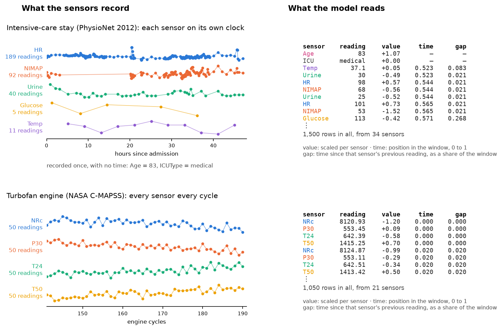

# Emblema

[](https://github.com/lstasiak/emblema/actions/workflows/ci.yml)
[](https://htmlpreview.github.io/?https://github.com/lstasiak/emblema/blob/python-coverage-comment-action-data/htmlcov/index.html)
[](https://www.python.org/)
[](https://github.com/astral-sh/uv)
[](https://github.com/astral-sh/ruff)
[](https://github.com/astral-sh/ty)
[](https://mypy-lang.org/)
[](https://import-linter.readthedocs.io/)
[](https://github.com/pre-commit/pre-commit)
[](LICENSE)

Emblema is a research platform for label-efficient representation learning on heterogeneous
sensor streams. One permutation-invariant, variable-channel transformer is pretrained without
labels on corpora that differ in channel count and sampling regime. It is then adapted to small
labelled tasks. The platform measures, with paired confidence intervals and tuned classical
baselines, whether and when that pretraining pays off. It can serve whichever candidate a
finished comparison measured.

## The name

In a Roman mosaic the *emblema* is the central panel. It was laid in a workshop from the finest
tesserae, then carried to the site and set into a floor of coarser tiles. The pretrained core
here is made once, over many corpora, and carried into new arrangements of sensors. Each
measurement is a *tessera*: a self-contained token of channel, time and value.


*Emblema with Pegasus, second century AD, Archaeological Museum of Córdoba. Photograph by
[Carole Raddato](https://commons.wikimedia.org/wiki/File:Mosaic_emblema_with_Pegasus,_the_immortal_winged_horse_which_sprang_forth_from_the_neck_of_Medusa_when_she_was_beheaded_by_the_hero_Perseus,_2nd_century_AD,_Archaeological_Museum_of_C%C3%B3rdoba,_Spain_(24783223879).jpg),
[CC BY-SA 2.0](https://creativecommons.org/licenses/by-sa/2.0/), via Wikimedia Commons; scaled down.*

## How it works

**The problem.** Industrial and scientific sensor data rarely looks like a neat table. A jet
engine reports 21 sensors every cycle; an intensive-care patient has a heart rate every few
minutes, a blood test twice a day and some values never measured; a satellite sends telemetry in
bursts between passes. Most time-series models expect a fixed set of channels on a regular
clock, so each new dataset is resampled, filled in and given a model of its own, trained from
its own labels. Labels are the expensive part.

**The idea.** Train one model on many unlabelled sensor datasets first, then adapt it to a new
task with only a few labels. This is what pretrained language models do for text. For it to work
across datasets, the model must not care how many sensors a dataset has or how often they are
read.

**Measurements as a bag of tokens.** Each measurement becomes one token: which sensor, its value
scaled per sensor, when it was taken within the window, and how long since that sensor's
previous reading. A window is the set of its tokens. Three sensors or thirty, read every second
or twice a day, it is the same kind of input, with nothing interpolated. Fixed facts, such as a
patient's age, become tokens without a time.



*Real data, tokenised by the code in this repository. Top: 48 hours of one intensive-care stay
(PhysioNet 2012), where heart rate is read 189 times and glucose 5. Bottom: the last 50 cycles of
one turbofan engine (NASA C-MAPSS), every sensor every cycle. On the right, the rows the model
receives for each: the same kind of input, of any length, from any sensors.*

**One encoder for any sensor set.** A transformer reads the whole set at once, in any order.
Each sensor has a learned identity vector, so a sensor it has never seen gets a new vector
learned from a little data while everything else carries over.

**Learning without labels.** During pretraining, parts of each window are hidden: whole sensors,
stretches of one sensor's time, or single readings. The model predicts the hidden values from
what remains, and counts as having learnt something only where it beats a simple method for the
same gap, such as interpolation or a regression on the other sensors.

**Adapting to a task.** The pretrained encoder is then used five ways on a small labelled task:
frozen with a small output layer trained, frozen with that layer solved in closed form, lightly
adjusted through a few extra weights (LoRA), fully fine-tuned, or trained from scratch as the
control. Each runs at several label budgets, from 50 labelled windows to all of them, tuned per
budget by the same declared procedure as the classical baselines.

**Keeping the comparison honest.**

- **Rules first.** The comparisons, the size of an improvement that counts and what is reported
  if the answer is no are committed before the runs they judge
  ([`docs/preregistration.md`](docs/preregistration.md)).
- **Engines, not windows.** Intervals are computed over engines or patients, the independent
  units, not over overlapping windows.
- **Strong baselines.** Gradient-boosted trees on window statistics, frequency features and
  MiniRocket compete in the same grid, tuned by the same declared procedure as the networks.
- **A positive control.** A generated dataset with known shared structure checks that the
  pipeline finds structure when it is there, so a negative result on real data means something.

## Status

Preliminary, on validation data. Each task's test data is used once, at the end.

On the first task, remaining useful life of turbofan engines (NASA C-MAPSS), pretraining does
not help. A first curve found the fine-tuned encoder 12 % better than the same network trained
from scratch at 200 labelled windows; diagnostics showed the control had been handicapped by
its head and its learning rate. Repeated with every arm tuned per budget by one declared
procedure, in one paired campaign with the classical baselines, the network trained from
scratch is the best candidate at every budget: 10 % better than the fine-tuned encoder at 200
labels, level with the tuned gradient-boosted trees.

On the second task, death in hospital after an intensive-care stay (PhysioNet 2012), no way of
using the mixed backbone beats the network trained from scratch, and the classical baselines
lead.
A diagnosis against a published network on the same stays found the deficit in the training,
not the data: kept at its best epoch on held-out labels and shrunk to two blocks, the network
trained from scratch lands within noise of the published one. Transfer is measured next under
that recipe, and across corpora, where a fresh encoder has nothing to learn from.

Numbers, intervals and limitations: [`docs/findings.md`](docs/findings.md).


*Error by number of labelled windows on C-MAPSS FD001, one paired campaign. Top: the five ways
of using the encoder (lower is better). Middle: the classical baselines beside the network
trained from scratch. Bottom: each pretrained arm's reduction against training from scratch
with its 95 % interval over engines; the grey band is the practical floor. Validation, not test.*

## Quickstart

Requires [uv](https://docs.astral.sh/uv/) and Python 3.12+, the Python of the free GPU platforms.

```sh
uv sync --all-extras
uv run pytest                    # unit, domain and application tests
uv run lint-imports              # architecture contracts
```

### Local stack

Postgres, Garage, MLflow, RabbitMQ and the API run in Docker:

```sh
cp env.example .env
docker compose up -d --wait      # builds the images and migrates the database
bash scripts/smoke.sh
uv run pytest -m integration     # adapter contracts against the stack
```

The API listens on `http://127.0.0.1:8000` (`/docs`, `/openapi.json`, `/health`, `/ready`,
`/metrics`).

The integration tests use their own database, the configured name with `_test` appended. The
merge gate is the same suite inside the image, on the interpreter, wheels and OS the processes
run on:

```sh
docker compose run --rm tests pytest -o addopts="-ra --strict-markers" --cov
```

On macOS XGBoost's OpenMP runtime cannot share a process with torch's, so the suite loads torch
first and skips the fits, which run in a process that refuses torch:
`uv run pytest --without-torch tests/evaluation/adapters/xgboost
tests/evaluation/adapters/test_classical_runtime_contract.py
tests/scripts/test_head_and_representation_report.py`. With `--env-file .env.r2` the
integration tests run against the remote bucket; the variable names are in `env.example`.

### Workflow

**Data.** Download from the sources of record, count, and publish a corpus as a block of windows
beside a manifest:

```sh
uv run scripts/fetch_corpora.py
uv run python -m emblema.entrypoints.cli.publish_corpus --corpus cmapss --window 50 --stride 5
```

**Pretraining.** Order a run here, run it on any machine with a GPU, accept the result against
the order ([ADR-0024](docs/adr/0024-handing-a-run-to-another-machine.md)); every parameter is in
the experiment file:

```sh
uv run python -m emblema.entrypoints.cli.pretrain order \
    --experiment experiments/<file>.toml --corpus <manifest key> <checksum> --run <name>
uv run python -m emblema.entrypoints.cli.pretrain run --order <key> <checksum>
uv run python -m emblema.entrypoints.cli.pretrain accept --result <key> <checksum> \
    --track http://127.0.0.1:5000
```

**Evaluation.** A campaign is declared from a committed file under `campaigns/`; its cells run on
the Celery workers or, where no broker reaches, from an order in the artifact store:

```sh
uv run python -m emblema.entrypoints.cli.campaign define-task --corpus <key> <checksum> --task turbofan-fd001
uv run python -m emblema.entrypoints.cli.campaign define --file campaigns/baselines-fd001.toml --task <task id>

# either through the queue
docker compose --profile workers up -d worker-ml worker-general
uv run python -m emblema.entrypoints.cli.campaign advance --campaign <id>

# or through an order, run anywhere and accepted back
uv run python -m emblema.entrypoints.cli.campaign order --campaign <id> --pool ml [--budget 200]
uv run python -m emblema.entrypoints.cli.campaign_run --order <key> <checksum>
uv run python -m emblema.entrypoints.cli.campaign accept --result <key> <checksum>
```

`campaign select` prints what a finished selection chose per budget; `campaign announce`
repeats a closed campaign's announcement with the checksum of every kept artifact.

**Serving.** Only an artifact a finished campaign kept can be promoted, by checksum
([ADR-0037](docs/adr/0037-promoting-what-a-campaign-kept.md)):

```sh
uv run python -m emblema.entrypoints.cli.serving promote --checksum <checksum>
uv run python -m emblema.entrypoints.cli.serving withdraw --model <model id>
```

A promoted model answers over HTTP with raw readings by channel name: unknown channels are
ignored and named in the answer, a window without a reading the model takes is refused
([ADR-0042](docs/adr/0042-the-prediction-service.md)):

```sh
curl -s -X POST http://127.0.0.1:8000/served-models/<model id>/predictions \
  -H 'Content-Type: application/json' \
  -d '{"windows": [{"start": 1, "length": 50,
                    "observations": [{"channel": "T24", "time": 1, "value": 641.8}]}]}'
```

`/embeddings` returns each window's pooled representation. What the networks run at once is
bounded by cost ([ADR-0043](docs/adr/0043-the-networks-memory-is-bounded-by-cost.md)): a
request that cannot start in time gets `503` with a `Retry-After`. `/campaigns` and its pages
show each comparison's design, curves, verdict and grid. Every refusal is a problem details
document (RFC 9457).

## Documentation

| Where | What |
| --- | --- |
| [`docs/findings.md`](docs/findings.md) | Results, setup and limitations on one page |
| [`docs/preregistration.md`](docs/preregistration.md) | Rules and configuration in force, with a register of every change |
| [`docs/adr/`](docs/adr/README.md) | Architecture decision records |
| [`docs/verification/`](docs/verification/README.md) | Dated measurement notes: the lab notebook |
