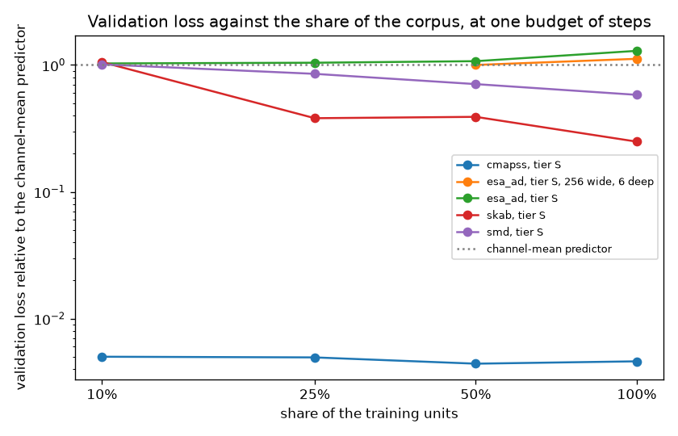
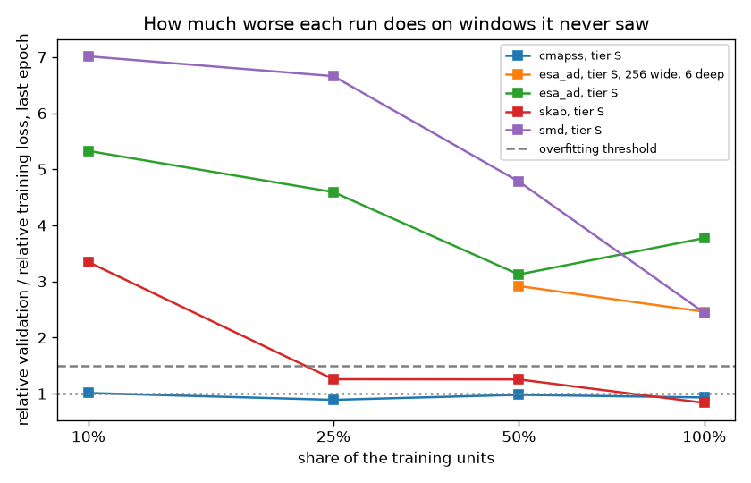
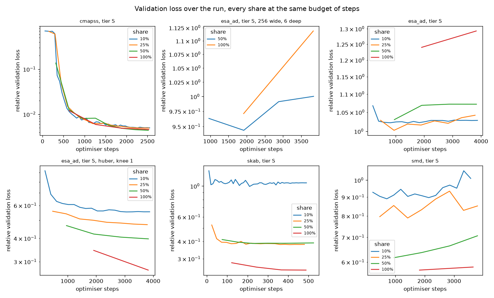
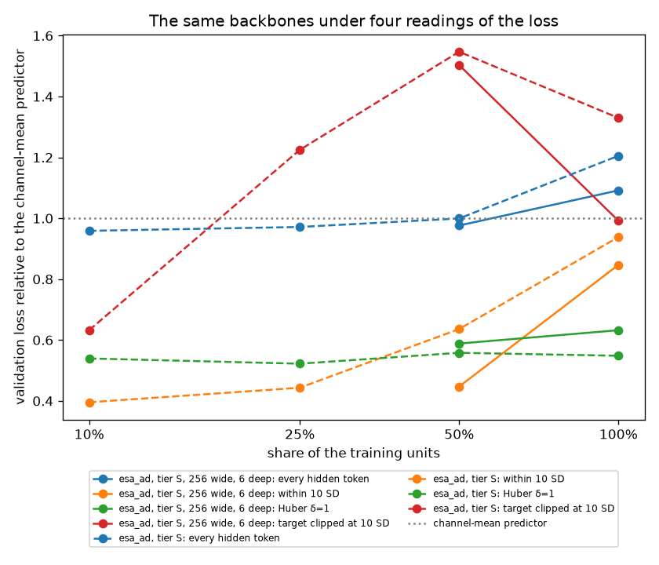
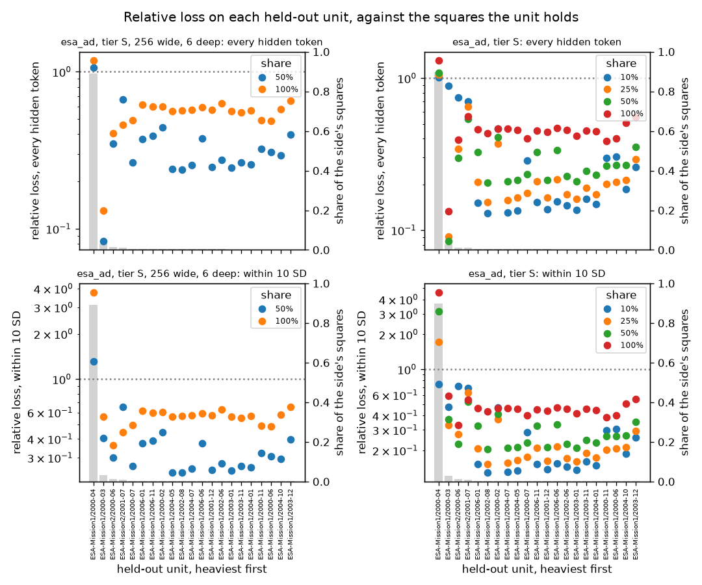
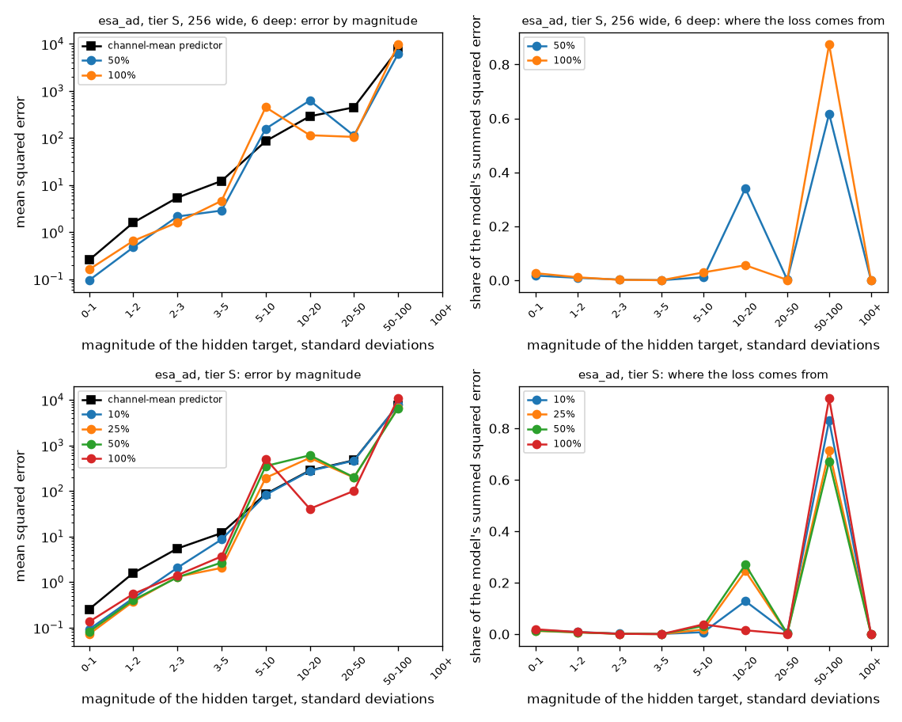

# Corpus saturation: does more of a corpus still lower the loss?

Purpose: before the first full pretraining run, replace the rule of thumb that admitted the
reference encoder — twenty unique observed values per parameter, a ratio fitted to language
models — with a measurement on the corpora themselves. A small model is trained over a tenth, a
quarter, half and all of a corpus's training units at one budget of optimiser steps, and its
validation loss at the end of each run is read against the share. The decisions are in ADR-0027
(how the measurement is made and judged) and in the dated section of ADR-0008 (what it did to
the parameter budget); this note records what was observed, where, and with which versions.

What must hold everywhere is a test, not a number here: that a share of a corpus is a share of
whole units, nested for one seed and honoured the same by every reader of a published corpus
(`tests/pretraining/ports/test_training_corpus_reader_contract.py`); that every share of a curve
spent one budget of steps and the verdict rules earn each verdict on a curve that should and
refuse it to one that should not (`tests/pretraining/domain/saturation`); that a run is written
as it goes, left alone once finished and picked up from its last checkpoint when a session drops
(`tests/scripts/test_corpus_saturation_report.py`). What this note adds is the curves of real
corpora on a real machine, and what an evening of them costs.

Every number here is measured on validation units. The test portions of every corpus are untouched.

Method, on a machine that holds the published corpora and the local stack:

```sh
uv sync --all-extras
uv run pytest tests/pretraining/domain/saturation tests/scripts/test_corpus_saturation_report.py
uv run scripts/corpus_saturation_report.py --corpus esa_ad <manifest key> <checksum> \
    --experiment saturation-esa_ad-s --device mps --track http://127.0.0.1:5000
uv run scripts/corpus_saturation_report.py --report-only          # the tables from the stored runs
uv run scripts/corpus_saturation_figures.py data/report/saturation/runs --figures docs/verification/figures
```

Each experiment in `experiments/saturation-*.toml` states the budget a run over the whole corpus
gets; the report derives for each share the epochs that spend the same steps, reads the share's
units, trains through the pretraining use case and stores each run under
`data/report/saturation/runs/<experiment>/<share>/` as it goes. A dropped session is resumed by
running the same command again: finished runs are skipped, the interrupted one is picked up from
the checkpoint its last recorded epoch reported. A smoke run (`--smoke`, `--epochs 1`, a share of
a few per cent) trains every share for the stated epochs instead and measures what an epoch costs.

## 2026-09-17 — the small tier over four corpora, one seed (macOS arm64, M1 Pro, MPS, fp32)

The first leg: the small tier's shape (192 wide, 4 blocks, 3 heads, feed-forward 768, twelve time
frequencies; 1.79M parameters over each corpus's own vocabulary, 1.81M over the mixture's) trained
over a tenth, a quarter, half and all of the training units of each published corpus, at the budget
of steps its experiment gives the whole corpus, seed 1, dropout 0, effective batch 32 (SMD in
micro-batches of 16 accumulated twice), fp32 on MPS. Validation was scored on every fourth window of
the held-out side, the same windows for every share: 1,290 C-MAPSS, 192 SKAB, 3,076 SMD and 3,846
ESA windows. The corpora are the versions in the local catalog: C-MAPSS at window 50 / stride 5
(block `bbee7fcd…`, 21 channels), SKAB at 100 / 10 (block `56141548…`, 8 channels), SMD at 50 / 10
(block `b686fdcf…`, 38 channels — republished at this window for the measurement, beside the
100 / 20 version) and ESA at one hour / one hour (block `20cb7969…`, 17 channels). The runs were
made from the ticket's own tree before it was committed, which the revision below records as dirty;
the code is the branch's, reviewed and committed after the measurement. MLflow experiments 6–9 on the
local server hold the same curves.

|  |  |
| --- | --- |
| Machine | macOS-26.6.2-arm64-arm-64bit-Mach-O, arm |
| Python | 3.14.7 |
| torch | 2.14.0 |
| Device | mps |
| Revision | 49cb280e6a801fc76eba2e3fc275bfc07082d559-dirty |
| Rule | every share of a corpus spends the optimiser steps its experiment gives the whole corpus, rounded to whole epochs; every share is scored on the same validation windows |

Commands, in the order run (the second and third read the stored runs and train nothing):

```sh
caffeinate -is uv run scripts/corpus_saturation_report.py \
    --corpus esa_ad <manifest> <checksum> --corpus smd <manifest> <checksum> \
    --corpus cmapss <manifest> <checksum> --corpus skab <manifest> <checksum> \
    --experiment saturation-esa_ad-s --experiment saturation-smd-s \
    --experiment saturation-cmapss-s --experiment saturation-skab-s \
    --validation-stride 4 --device mps --track http://127.0.0.1:5000 2>&1 | tee data/report/saturation/leg-1.log
uv run scripts/corpus_saturation_report.py --report-only --experiment saturation-cmapss-s \
    --experiment saturation-esa_ad-s --experiment saturation-skab-s --experiment saturation-smd-s
uv run scripts/corpus_saturation_figures.py data/report/saturation/runs --figures docs/verification/figures
```

### What it cost

Sixteen runs in 16.0 hours of wall clock (23:32 to 15:30), against 14.8 hours projected from the
smoke run; the difference is one epoch of the SMD half share that took 36 minutes instead of 24
while the machine was in use. Seconds per optimiser step at the whole share, validation passes
included: ESA 1.32, SMD 1.53, C-MAPSS 1.01, SKAB 0.41. By corpus: ESA 5.8 h, SMD 6.8 h, C-MAPSS 3.0 h,
SKAB 0.24 h. Every share of a corpus costs the same, as the rule intends, to within the epoch
rounding and the validation passes a share with more epochs makes.

### Curves and verdicts

#### saturation-cmapss-s

| Share | Training windows | Epochs | Steps | Last training | Last validation | Relative training | Relative validation | Best validation (epoch) | Gap | Minutes | Finished |
| --- | --- | --- | --- | --- | --- | --- | --- | --- | --- | --- | --- |
| 10% | 1841 | 44 | 2552 | 0.0050 | 0.0051 | 0.005 | 0.005 | 0.005 at 44/44 | 1.01× | 50 min | yes |
| 25% | 4768 | 17 | 2533 | 0.0056 | 0.0051 | 0.006 | 0.005 | 0.005 at 17/17 | 0.89× | 45 min | yes |
| 50% | 10057 | 8 | 2520 | 0.0045 | 0.0045 | 0.005 | 0.004 | 0.004 at 8/8 | 0.98× | 43 min | yes |
| 100% | 20237 | 4 | 2532 | 0.0049 | 0.0047 | 0.005 | 0.005 | 0.005 at 4/4 | 0.93× | 43 min | yes |

Relative losses are against the trivial predictor's on the same side — the channel mean, whose error is 1.022 on the validation side and 1.013 on the training side of the smallest share; the gap is their ratio. Best validation is the lowest of the run's epochs, with the epoch it fell at; the verdict reads the last epoch, where every share has spent its budget.

Gains in validation loss share to share: 10%→25% +1.2%, 25%→50% +10.8%, 50%→100% -4.4%.

**saturated** — the step from 50% to 100% of the training units lowered validation by -4.4%, under 5%: the corpus is learnt at this size and budget, and a larger model over it gains nothing — other corpora would.

#### saturation-esa_ad-s

| Share | Training windows | Epochs | Steps | Last training | Last validation | Relative training | Relative validation | Best validation (epoch) | Gap | Minutes | Finished |
| --- | --- | --- | --- | --- | --- | --- | --- | --- | --- | --- | --- |
| 10% | 6515 | 19 | 3876 | 0.0846 | 5.0541 | 0.193 | 1.028 | 1.022 at 7/19 | 5.33× | 94 min | yes |
| 25% | 15154 | 8 | 3792 | 0.1080 | 5.1210 | 0.227 | 1.042 | 1.003 at 2/8 | 4.59× | 86 min | yes |
| 50% | 30700 | 4 | 3840 | 0.2386 | 5.2678 | 0.343 | 1.072 | 1.030 at 1/4 | 3.12× | 85 min | yes |
| 100% | 61299 | 2 | 3832 | 0.3426 | 6.3533 | 0.343 | 1.293 | 1.240 at 1/2 | 3.77× | 84 min | yes |

Relative losses are against the trivial predictor's on the same side — the channel mean, whose error is 4.915 on the validation side and 0.438 on the training side of the smallest share; the gap is their ratio. Best validation is the lowest of the run's epochs, with the epoch it fell at; the verdict reads the last epoch, where every share has spent its budget.

Gains in validation loss share to share: 10%→25% -1.3%, 25%→50% -2.9%, 50%→100% -20.6%.

**not learnt** — at the whole share validation is 1.29× the trivial predictor's: nothing carried over to the held-out side, so the curve reads nothing about the data — the held-out side, or the loss it is scored by, comes before the corpus is judged.

#### saturation-skab-s

| Share | Training windows | Epochs | Steps | Last training | Last validation | Relative training | Relative validation | Best validation (epoch) | Gap | Minutes | Finished |
| --- | --- | --- | --- | --- | --- | --- | --- | --- | --- | --- | --- |
| 10% | 290 | 49 | 490 | 0.2771 | 1.3257 | 0.315 | 1.054 | 0.993 at 21/49 | 3.35× | 4 min | yes |
| 25% | 738 | 20 | 480 | 0.2770 | 0.4785 | 0.303 | 0.381 | 0.379 at 17/20 | 1.26× | 4 min | yes |
| 50% | 2391 | 7 | 525 | 0.2838 | 0.4904 | 0.311 | 0.390 | 0.387 at 3/7 | 1.25× | 4 min | yes |
| 100% | 3896 | 4 | 488 | 0.2991 | 0.3127 | 0.297 | 0.249 | 0.249 at 4/4 | 0.84× | 3 min | yes |

Relative losses are against the trivial predictor's on the same side — the channel mean, whose error is 1.257 on the validation side and 0.880 on the training side of the smallest share; the gap is their ratio. Best validation is the lowest of the run's epochs, with the epoch it fell at; the verdict reads the last epoch, where every share has spent its budget.

Gains in validation loss share to share: 10%→25% +63.9%, 25%→50% -2.5%, 50%→100% +36.2%.

**data-limited** — the step from 50% to 100% of the training units lowered validation by 36.2%: the data, not the model, is the limit at this budget — the corpus suits pretraining and more of it would help.

#### saturation-smd-s

| Share | Training windows | Epochs | Steps | Last training | Last validation | Relative training | Relative validation | Best validation (epoch) | Gap | Minutes | Finished |
| --- | --- | --- | --- | --- | --- | --- | --- | --- | --- | --- | --- |
| 10% | 7597 | 15 | 3570 | 0.1599 | 1.4632 | 0.144 | 1.011 | 0.890 at 3/15 | 7.01× | 100 min | yes |
| 25% | 15195 | 8 | 3800 | 0.1400 | 1.2323 | 0.128 | 0.851 | 0.790 at 3/8 | 6.66× | 105 min | yes |
| 50% | 30387 | 4 | 3800 | 0.1523 | 1.0230 | 0.148 | 0.707 | 0.616 at 1/4 | 4.78× | 111 min | yes |
| 100% | 58411 | 2 | 3652 | 0.2253 | 0.8418 | 0.238 | 0.582 | 0.571 at 1/2 | 2.44× | 93 min | yes |

Relative losses are against the trivial predictor's on the same side — the channel mean, whose error is 1.447 on the validation side and 1.109 on the training side of the smallest share; the gap is their ratio. Best validation is the lowest of the run's epochs, with the epoch it fell at; the verdict reads the last epoch, where every share has spent its budget.

Gains in validation loss share to share: 10%→25% +15.8%, 25%→50% +17.0%, 50%→100% +17.7%.

**overfitting** — at the whole share validation is 2.44× training, each against its own trivial predictor, past 1.5×: the model fits windows it will not see again, so the data is too little for it — a smaller model, or more units.







### Reading

**C-MAPSS is saturated at the objective's floor.** Every share ends at half a per cent of the
channel variance on both sides, the gap is one, and every share reaches that floor within about
1,500 steps regardless of how much of the corpus it read (the first panel of the third figure).
Hiding tokens of a 50-cycle window of these sensors leaves them nearly determined by the tokens
left visible — the sensors follow a few latent states — so the floor is the objective's, not the
data's: more C-MAPSS, or more passes over it, teaches the encoder nothing at this size. The corpus
remains the host of the remaining-useful-life task; as pretraining data it is learnt from a quarter
of its engines.

**SMD is the clean curve, and it says data-limited and overfitting at once.** Each doubling of the
units lowers the validation loss by 16–18 %, with no sign of flattening at the whole corpus; the gap
shrinks from 7.0× at a tenth to 2.4× at the whole; and every run's best epoch is its first or
third, after which validation rises while training keeps falling (the fourth panel). The rules
fixed beforehand call it overfitting, because the gap at the whole share is past 1.5×, and what
that verdict prescribes — more units — is what the curve shows working: the overfitting recedes
as the units come. Read at each run's best epoch instead of its last, the shares order the same
way (0.89, 0.79, 0.62, 0.57).

**SKAB is data-limited on a corpus of 3,896 windows.** A tenth of its experiments (290 windows)
learns nothing of the held-out side; a quarter and a half tie at 0.38; the whole reaches 0.25, with
a gap under one — the held-out experiments are easier than the training ones for this model. The
curve is not monotone and rests on one seed, so the verdict stands on its last step and on nothing
else. A small ingredient of the mix, as the corpus arithmetic had said.

**ESA's held-out months were not learnt, at any share.** The validation loss never falls under the
channel mean's — 1.00 at best, 1.02–1.07 at the last epoch of the three smaller shares, 1.24–1.29
at the whole — while the training side is learnt to 0.19–0.34 of its variance. The 21 held-out
months carry excursions of up to 96 standard deviations, the channel mean errs 4.9 there against
0.44–1.0 on the training sides, and a squared error over such months is decided by a few windows on
which no model trained on other months does better than the mean. Measured on the published block:
one held-out month of the 21, `ESA-Mission1/2000-04` — the first weeks of the mission — holds 88 %
of the side's squared magnitude; the 0.3 % of its tokens past ten standard deviations hold 91 % of
it, and 1 % of its windows 92 %; the other 99.7 % of the tokens have a mean square of 0.45, easier
than the training side's ordinary tokens at 0.56. What the model does on those tokens is invisible
in this loss. The training side is half the same story: 0.13 % of its tokens hold 45 % of its
squared magnitude, so the objective's gradient over this corpus is half from excursions. The run
over the whole corpus does worse than the small ones, not better, because its training months
hold excursions of their own (three months with a mean square of 10–14) and a model that learns
to reproduce them is punished where they do not recur. The rules fixed beforehand read this as overfitting
(3.77×) and prescribed a smaller model or more units, which is the wrong remedy for a side that was
never learnt; the fourth reading, "not learnt", was added for this case after the curve was drawn
and is declared as such in ADR-0027. What this leg says about the satellite corpus is therefore
about its held-out side and its loss, not about its volume.

**Within every run but C-MAPSS, validation is best after one to three epochs.** The rule of equal
steps repeats a tenth of a corpus fifteen to forty-nine times, and at 1.79M parameters and about
3,800 steps of batch 32 the small tier overfits each classical corpus on its own within one or two
passes — the whole of SMD is best after its first epoch of two. The best-validation column reads
what early stopping would have kept; it changes no verdict and no ordering of shares.

### Limitations

- One seed. Shares of one seed are nested, so the curve of a corpus carries no between-subset
  variation, but a second seed would show how much of SKAB's non-monotone curve is the draw of
  three experiments.
- The budget is an evening's, not convergence: C-MAPSS converged, the other three did not, and
  every verdict is read at this budget. Whether the reading holds at the budget of a full
  pretraining run is what that run's own curve shows.
- Validation on every fourth window, so the validation numbers carry the sampling error of a
  quarter of the held-out side; the same windows for every share, so the comparison between
  shares does not.
- The loss is an unbounded squared error in units normalised on the training side, and the split
  holds out whole months at random. On an anomaly benchmark both are the wrong instruments for a
  saturation curve: a bounded loss (or excursions clipped in the objective, never in the
  tokeniser, which the anomaly task needs raw) and a held-out side that spreads the excursion
  months are what the satellite curve needs before it can be read; the concentration figures above
  are from the block's own values (tokens past ten standard deviations, per month), not from any
  model, and are to be regenerated by the diagnostic that scores these runs on ordinary tokens.
- ESA's ragged windows are padded to the longest in each batch (a median of 720 tokens against a
  maximum of 1,331), so the satellite runs cost about a third more per step than their tokens; the
  cost table above is what the padding cost, not what the tokens would.
- The tree was dirty: the code of the measurement was the branch's own, uncommitted; the revision
  column names the commit it was built on.
- The small tier's shape only. The reference shape over the half and the whole of ESA and SMD, at
  the same budget of steps and on the same machine, is the second leg; its section follows when it
  ends.

### What it decided

Recorded in the dated section of ADR-0008: the reference shape of the published tier stands for
the mixed backbone and the sweep past it is closed at this stage; the third satellite mission is not
added; corpora are mixed from the first full run as before, with C-MAPSS weighted as data that is
learnt from a quarter of it, and with the satellite corpus's held-out months scored apart from the
mix's and their loss reconsidered before its share of the mix is judged.

## 2026-09-17 — the reference shape over the satellite corpus, second leg (macOS arm64, M1 Pro, MPS, fp32)

The size axis, on the satellite corpus alone: the published tier's shape (256 wide, 6 blocks,
4 heads, feed-forward 1024, twelve time frequencies; 4.75M parameters over ESA's 17 channels)
over the half and the whole of ESA's training units, at the same steps as the small shape's runs
(3,840 and 3,832), seed 1, dropout 0, micro-batches of 16 accumulated twice, on the same machine
and the same validation windows. The experiment file declares the small tier's machine and states
the reference shape field by field, which is how the figures label it: "tier S, 256 wide, 6 deep".
The SMD half of the leg was stopped before its first epoch ended, so the size axis on the largest
classical corpus is unmeasured; a run directory with settings and no epochs remains under
`runs/saturation-smd-m/0.5/`, and a later run of the same command starts it afresh.

Same commands as the first leg with `--experiment saturation-esa_ad-m --experiment saturation-smd-m`
and `--fractions 0.5 1`; the report rendered with `--report-only --experiment saturation-esa_ad-m`;
the figures redrawn from all stored runs, so the reference shape joins the three figures above
rather than getting a set of its own.

### What it cost

108 and 104 minutes: 1.69 s per optimiser step at the half share and 1.63 s at the whole, validation
passes included, against 1.32 s for the small shape over the same corpus — the reference shape
costs about a quarter more per step on this corpus, less than its 2.7× parameters, because the
padded attention over ragged windows is the larger part of a step at either shape.

### Curve and verdict

#### saturation-esa_ad-m

| Share | Training windows | Epochs | Steps | Last training | Last validation | Relative training | Relative validation | Best validation (epoch) | Gap | Minutes | Finished |
| --- | --- | --- | --- | --- | --- | --- | --- | --- | --- | --- | --- |
| 50% | 30700 | 4 | 3840 | 0.2384 | 4.9164 | 0.343 | 1.000 | 0.944 at 2/4 | 2.92× | 108 min | yes |
| 100% | 61299 | 2 | 3832 | 0.4547 | 5.4981 | 0.455 | 1.119 | 0.971 at 1/2 | 2.46× | 104 min | yes |

Relative losses are against the trivial predictor's on the same side — the channel mean, whose error is 4.915 on the validation side and 0.696 on the training side of the smallest share; the gap is their ratio. Best validation is the lowest of the run's epochs, with the epoch it fell at; the verdict reads the last epoch, where every share has spent its budget.

Gains in validation loss share to share: 50%→100% -11.8%.

**not learnt** — at the whole share validation is 1.12× the trivial predictor's: nothing carried over to the held-out side, so the curve reads nothing about the data — the held-out side, or the loss it is scored by, comes before the corpus is judged.

### Reading

The reference shape lowers the held-out loss against the small shape at both shares — 1.000
against 1.072 at the half, 1.119 against 1.293 at the whole — and its best epochs (0.944 at the
half, 0.971 at the whole) are the only satellite runs of either leg that fell under the channel
mean at all. It is still read as not learnt at the last epoch, by the same 0.3 % of tokens that
decide the small shape's runs, and within each run validation is best after one or two epochs and
rises while training falls, as at the small shape. The size axis on this corpus therefore says
that a larger model reproduces the training months' excursions a little better on the held-out
side, and no more: it does not change the reading, which belongs to the loss and the split. What
the reference shape earns on the largest single corpus is not measured here, and the decision on
the shape of single-corpus backbones in ADR-0008 stays provisional.

## 2026-09-17 — the satellite backbones scored apart from the excursions (macOS arm64, M1 Pro, MPS, fp32)

The first leg read the satellite corpus as not learnt and said the reading belonged to the loss
and the split, not to the model: a few tokens in a thousand held nine tenths of the held-out
loss. What the model did on the other tokens was invisible in that number. This section scores
the six stored satellite backbones — the small shape over four shares, the reference shape over
two — on the validation windows their runs scored, under the masks their runs drew, and reads the
loss four ways: over every hidden token, which must reproduce the runs' own validation losses;
over the hidden tokens within ten standard deviations of their channel; as a Huber loss with the
knee at one deviation; and with the target clipped at ten. It also regenerates, from the block's
values and no model, the concentration figures the first leg quoted from a one-off script.

Method, on the machine that holds the stored runs and the published block:

```sh
uv run pytest tests/scripts/test_excursion_report.py tests/scripts/test_excursion_figures.py
uv run scripts/excursion_report.py --corpus esa_ad <manifest key> <checksum> \
    --experiment saturation-esa_ad-s --experiment saturation-esa_ad-m --device mps
uv run scripts/excursion_report.py --report-only
uv run scripts/excursion_figures.py data/report/saturation/excursions --figures docs/verification/figures
```

The report weighs every window of both sides of the block, then scores each finished run's
backbone in the run's own micro-batches, in block order, on every fourth validation window as the
run did, with the masks of each batch drawn from the generator the training runtime seeds for that
batch. Everything is written as CSV under `data/report/saturation/excursions/` — a row per window
and side, a row per backbone, window and reading, a row per bin of target magnitude — and the
tables and figures are made from those files.

|  |  |
| --- | --- |
| Machine | macOS-26.6.2-arm64-arm-64bit-Mach-O, arm |
| Python | 3.14.7 |
| torch | 2.14.0 |
| Device | mps |
| Revision | ffa1245dcb8eae3d077575a79e968ff413ac5d5f-dirty |
| Corpus | esa_ad |
| Block | sha256:20cb7969c6902c1a5305d37a912ea9b325b040757ae22c631e9a4df5905698af |
| Excursion | a token past 10 standard deviations of its channel |
| Huber δ | 1 |
| Rule | every backbone is scored on the validation windows its run scored, under the masks its run drew; the trivial predictor is scored on the same tokens |

The scripts were on the branch and uncommitted when the measurement ran, which the revision
records as dirty; the code is the branch's, reviewed and committed after it.

### What it cost

Three minutes: 20 s to weigh the 76,682 windows of the block, 21 s per backbone of the small
shape and 37–39 s per backbone of the reference shape, on 3,846 validation windows each.

### Where the squared magnitude of each side lies

| Side | Windows | Tokens | Mean square | Tokens past 10 SD | Their share of the squares | Unit holding most | Heaviest 1% of windows | Mean square within |
| --- | --- | --- | --- | --- | --- | --- | --- | --- |
| training | 61,299 | 52,395,556 | 1.000 | 69,169 (0.13%) | 44.5% | `ESA-Mission1/2002-05` (14.5%) | 55.9% | 0.555 |
| validation | 15,383 | 11,928,186 | 4.858 | 36,620 (0.31%) | 90.8% | `ESA-Mission1/2000-04` (88.1%) | 91.8% | 0.448 |

From the block's values alone, over every token of every window of the side: the mean square is
the channel-mean predictor's error there, and a squared error over the side is decided by whatever
holds the squares. These are the first leg's figures, regenerated: one held-out month holds 88 %
of the side's squared magnitude, three tokens in a thousand hold 91 %, one window in a hundred
92 %, and the tokens within the threshold have a mean square of 0.45 on the held-out side against
0.56 on the training side. On the training side, 0.13 % of the tokens hold 45 %.

### saturation-esa_ad-s

| Share | Hidden tokens | Hidden ratio | Validation loss, the run's | Validation loss, here | Relative, every token | Relative, within 10 SD | Relative, Huber δ=1 | Relative, clipped at 10 SD |
| --- | --- | --- | --- | --- | --- | --- | --- | --- |
| 10% | 1,379,092 | 0.4624 | 5.0541 | 5.0541 | 0.959 | 0.395 | 0.539 | 0.632 |
| 25% | 1,379,092 | 0.4624 | 5.1210 | 5.1210 | 0.971 | 0.443 | 0.522 | 1.225 |
| 50% | 1,379,092 | 0.4624 | 5.2678 | 5.2678 | 0.999 | 0.636 | 0.558 | 1.547 |
| 100% | 1,379,092 | 0.4624 | 6.3533 | 6.3533 | 1.205 | 0.938 | 0.548 | 1.330 |

Relative losses are the model's over the channel-mean predictor's on the same hidden tokens, so
one is nothing learnt. Every token reproduces the run's own validation loss; within the threshold
leaves the excursions out; Huber and clipped score every token under a loss that bounds what one
excursion costs. The channel mean errs 5.27 on the hidden tokens against 4.91 on every token of
the side, so the relative numbers over every token sit some 7 % under the first leg's, which
divided by the side's mean square; the shares order the same way.

#### saturation-esa_ad-s, by held-out unit

| Unit | Hidden tokens | Mean square | Share of the side's squares | 10% | 25% | 50% | 100% |
| --- | --- | --- | --- | --- | --- | --- | --- |
| `ESA-Mission1/2000-04` | 60,502 | 107.837 | 89.7% | 1.01 / 0.74 | 1.06 / 1.73 | 1.09 / 3.17 | 1.30 / 4.59 |
| `ESA-Mission1/2000-03` | 60,119 | 3.499 | 2.9% | 0.89 / 0.47 | 0.09 / 0.33 | 0.08 / 0.37 | 0.13 / 0.59 |
| `ESA-Mission2/2000-06` | 108,321 | 0.835 | 1.2% | 0.74 / 0.72 | 0.34 / 0.28 | 0.30 / 0.23 | 0.39 / 0.33 |
| `ESA-Mission2/2001-07` | 115,359 | 0.630 | 1.0% | 0.70 / 0.69 | 0.65 / 0.63 | 0.54 / 0.52 | 0.56 / 0.55 |
| `ESA-Mission1/2006-01` | 62,135 | 0.396 | 0.3% | 0.15 / 0.15 | 0.21 / 0.21 | 0.33 / 0.33 | 0.46 / 0.46 |
| `ESA-Mission1/2002-08` | 62,754 | 0.390 | 0.3% | 0.13 / 0.13 | 0.15 / 0.15 | 0.20 / 0.20 | 0.43 / 0.43 |
| `ESA-Mission1/2000-02` | 58,436 | 0.416 | 0.3% | 0.47 / 0.47 | 0.37 / 0.37 | 0.41 / 0.41 | 0.46 / 0.46 |
| `ESA-Mission1/2004-07` | 62,010 | 0.391 | 0.3% | 0.13 / 0.13 | 0.16 / 0.16 | 0.21 / 0.21 | 0.46 / 0.46 |
| `ESA-Mission1/2004-05` | 62,127 | 0.388 | 0.3% | 0.13 / 0.13 | 0.16 / 0.16 | 0.21 / 0.21 | 0.45 / 0.45 |
| `ESA-Mission1/2000-07` | 61,252 | 0.392 | 0.3% | 0.29 / 0.29 | 0.18 / 0.18 | 0.23 / 0.23 | 0.40 / 0.40 |
| `ESA-Mission1/2006-11` | 58,768 | 0.404 | 0.3% | 0.15 / 0.15 | 0.21 / 0.21 | 0.33 / 0.33 | 0.45 / 0.45 |
| `ESA-Mission1/2001-12` | 62,876 | 0.374 | 0.3% | 0.14 / 0.14 | 0.16 / 0.16 | 0.21 / 0.21 | 0.44 / 0.44 |
| `ESA-Mission1/2006-06` | 60,255 | 0.388 | 0.3% | 0.15 / 0.15 | 0.21 / 0.21 | 0.33 / 0.33 | 0.47 / 0.47 |
| `ESA-Mission1/2002-06` | 59,844 | 0.368 | 0.3% | 0.15 / 0.15 | 0.17 / 0.17 | 0.23 / 0.23 | 0.46 / 0.46 |
| `ESA-Mission1/2003-01` | 60,253 | 0.362 | 0.3% | 0.14 / 0.14 | 0.16 / 0.16 | 0.21 / 0.21 | 0.42 / 0.42 |
| `ESA-Mission1/2003-11` | 60,559 | 0.349 | 0.3% | 0.16 / 0.16 | 0.19 / 0.19 | 0.25 / 0.25 | 0.45 / 0.45 |
| `ESA-Mission1/2004-01` | 60,796 | 0.341 | 0.3% | 0.15 / 0.15 | 0.17 / 0.17 | 0.23 / 0.23 | 0.45 / 0.45 |
| `ESA-Mission1/2000-11` | 59,741 | 0.327 | 0.3% | 0.30 / 0.30 | 0.20 / 0.20 | 0.27 / 0.27 | 0.39 / 0.39 |
| `ESA-Mission1/2000-06` | 58,353 | 0.323 | 0.3% | 0.31 / 0.31 | 0.21 / 0.21 | 0.27 / 0.27 | 0.40 / 0.40 |
| `ESA-Mission1/2004-10` | 62,810 | 0.292 | 0.3% | 0.19 / 0.19 | 0.21 / 0.21 | 0.27 / 0.27 | 0.51 / 0.51 |
| `ESA-Mission1/2003-12` | 61,822 | 0.213 | 0.2% | 0.26 / 0.26 | 0.29 / 0.29 | 0.35 / 0.35 | 0.56 / 0.56 |

Units in order of the squares their hidden tokens hold; each share's cell is the relative loss
over every hidden token / over those within 10 SD.

#### saturation-esa_ad-s, by window

| Share | Median | p90 | p99 | Worst | Heaviest 1% | Median within 10 SD | p90 | p99 | Worst | Heaviest 1% |
| --- | --- | --- | --- | --- | --- | --- | --- | --- | --- | --- |
| 10% | 0.19 | 0.51 | 1.2 | 5.4 | 97.5% | 0.19 | 0.51 | 1.2 | 5.4 | 31.4% |
| 25% | 0.19 | 0.40 | 1.1 | 2.9 | 98.0% | 0.19 | 0.40 | 1.2 | 4.0 | 51.6% |
| 50% | 0.24 | 0.44 | 1.0 | 2.0 | 97.9% | 0.24 | 0.44 | 1.1 | 5.9 | 61.9% |
| 100% | 0.41 | 0.64 | 1.1 | 1.8 | 97.3% | 0.41 | 0.64 | 1.1 | 8.1 | 60.6% |

The relative loss of single windows, and the share of the model's summed loss the heaviest 1% of
windows hold; over every hidden token, then within the threshold.

### saturation-esa_ad-m

| Share | Hidden tokens | Hidden ratio | Validation loss, the run's | Validation loss, here | Relative, every token | Relative, within 10 SD | Relative, Huber δ=1 | Relative, clipped at 10 SD |
| --- | --- | --- | --- | --- | --- | --- | --- | --- |
| 50% | 1,389,673 | 0.4660 | 4.9164 | 4.9164 | 0.976 | 0.447 | 0.588 | 1.503 |
| 100% | 1,389,673 | 0.4660 | 5.4981 | 5.4981 | 1.092 | 0.847 | 0.632 | 0.992 |

The reference shape's runs took micro-batches of sixteen, so their batches and their masks differ
from the small shape's; the hidden tokens differ by ten thousand and the ratio by four thousandths.

#### saturation-esa_ad-m, by held-out unit

| Unit | Hidden tokens | Mean square | Share of the side's squares | 50% | 100% |
| --- | --- | --- | --- | --- | --- |
| `ESA-Mission1/2000-04` | 61,944 | 100.794 | 89.2% | 1.06 / 1.31 | 1.17 / 3.77 |
| `ESA-Mission1/2000-03` | 57,456 | 3.759 | 3.1% | 0.08 / 0.41 | 0.13 / 0.56 |
| `ESA-Mission2/2000-06` | 112,911 | 0.836 | 1.3% | 0.35 / 0.30 | 0.40 / 0.36 |
| `ESA-Mission2/2001-07` | 113,527 | 0.609 | 1.0% | 0.67 / 0.66 | 0.46 / 0.44 |
| `ESA-Mission1/2000-07` | 62,641 | 0.400 | 0.4% | 0.26 / 0.26 | 0.49 / 0.49 |
| `ESA-Mission1/2006-01` | 63,363 | 0.395 | 0.4% | 0.37 / 0.37 | 0.62 / 0.62 |
| `ESA-Mission1/2006-11` | 61,466 | 0.403 | 0.4% | 0.39 / 0.39 | 0.60 / 0.60 |
| `ESA-Mission1/2000-02` | 58,927 | 0.417 | 0.4% | 0.44 / 0.44 | 0.60 / 0.60 |
| `ESA-Mission1/2004-05` | 63,363 | 0.383 | 0.3% | 0.24 / 0.24 | 0.56 / 0.56 |
| `ESA-Mission1/2002-08` | 61,407 | 0.391 | 0.3% | 0.24 / 0.24 | 0.57 / 0.57 |
| `ESA-Mission1/2004-07` | 60,831 | 0.393 | 0.3% | 0.25 / 0.25 | 0.57 / 0.57 |
| `ESA-Mission1/2006-06` | 61,043 | 0.391 | 0.3% | 0.37 / 0.37 | 0.59 / 0.59 |
| `ESA-Mission1/2001-12` | 62,530 | 0.374 | 0.3% | 0.25 / 0.25 | 0.57 / 0.57 |
| `ESA-Mission1/2002-06` | 61,567 | 0.373 | 0.3% | 0.28 / 0.28 | 0.63 / 0.63 |
| `ESA-Mission1/2003-01` | 59,889 | 0.364 | 0.3% | 0.25 / 0.25 | 0.56 / 0.56 |
| `ESA-Mission1/2003-11` | 59,931 | 0.356 | 0.3% | 0.26 / 0.26 | 0.55 / 0.55 |
| `ESA-Mission1/2004-01` | 62,242 | 0.339 | 0.3% | 0.26 / 0.26 | 0.57 / 0.57 |
| `ESA-Mission1/2000-11` | 59,645 | 0.330 | 0.3% | 0.32 / 0.32 | 0.49 / 0.49 |
| `ESA-Mission1/2000-06` | 60,138 | 0.318 | 0.3% | 0.31 / 0.31 | 0.49 / 0.49 |
| `ESA-Mission1/2004-10` | 62,657 | 0.288 | 0.3% | 0.29 / 0.29 | 0.58 / 0.58 |
| `ESA-Mission1/2003-12` | 62,195 | 0.213 | 0.2% | 0.40 / 0.40 | 0.66 / 0.66 |

#### saturation-esa_ad-m, by window

| Share | Median | p90 | p99 | Worst | Heaviest 1% | Median within 10 SD | p90 | p99 | Worst | Heaviest 1% |
| --- | --- | --- | --- | --- | --- | --- | --- | --- | --- | --- |
| 50% | 0.28 | 0.50 | 1.1 | 2.8 | 97.3% | 0.28 | 0.50 | 1.2 | 3.1 | 36.0% |
| 100% | 0.51 | 0.80 | 1.2 | 1.9 | 96.2% | 0.52 | 0.80 | 1.2 | 6.1 | 46.1% |







### Reading

**The scoring is the runs' own.** All six backbones reproduce their run's last validation loss to
four decimals and its hidden ratio to four, so what follows is read on the tokens the runs were
judged on, under the masks they were judged under.

**The ordinary behaviour of the corpus was learnt, at every share and both shapes.** Over the
twenty held-out months other than `2000-04`, the small shape's error is 0.23–0.51 of the channel
mean's over every hidden token (0.27–0.45 within the threshold) and the reference shape's
0.28–0.41; over the whole side within the threshold, 0.40–0.94 and 0.45–0.85; the median
window sits at 0.19–0.51 of the mean's error. The first leg's *not learnt* was the loss's and the
split's reading, as it said: the model is not the problem.

**But the loss on the ordinary tokens rises with the share, from a quarter of the corpus on.**
From the quarter share up, every ordinary month of Mission1 is worse at each larger share — 0.15
to 0.37 of the mean's error at a quarter, 0.20 to 0.41 at a half, 0.39 to 0.56 at the whole — and
the twenty ordinary months together go from 0.23 at a quarter to 0.36 at the whole. The two
months of Mission2 and the second-heaviest month, `2000-03`, are not monotone; the tenth share,
whose model had seen six thousand windows, is above the quarter's on several months. The bins
say why. The whole-corpus model reproduces excursions of
10–20 deviations seven times better than the mean does (a mean square of 40.6 against 283 over
3,240 tokens) and pays for it where the tokens are: in the 0–1 bin, nine tenths of the hidden
tokens, its error is 0.135 against the tenth-share model's 0.092, and in the 5–10 bin it errs
509 against 82, predicting an excursion where a moderate value is. Under a squared error the
training gradient of this corpus is 45 % from 0.13 % of its tokens, and the shares are where
those tokens come in. Because the shares are nested, it can be said which share brings them: the
mean square of the training side itself climbs 0.44, 0.48, 0.70, 1.00 over the four shares, and
the four heaviest training months — mean squares of 3.9 to 14.2 — all enter at the whole corpus
and at no smaller share. That is where the ordinary-token loss jumps: 0.23 at a quarter and 0.25
at a half, neither holding those months, then 0.36 at the whole. Four points of one seed are a
correspondence and not a proof, but the direction is the objective's: at equal steps more data is
more of the budget spent on excursions no held-out month repeats. The same backbones read under
the Huber loss sit flat across the shares, 0.52–0.56 at the small shape: what moves between
shares under the squared error is the excursions' doing. The satellite curve
of the first leg therefore reads the objective, not the data, and a saturation curve of this
corpus is a run under a loss that bounds what one excursion costs, not a re-reading of these.

**The excursion month is not learnable from the other side under this split, its ordinary tokens
included.** Of `2000-04`'s 60,502 hidden tokens, 57,144 lie within the threshold, where the
channel mean errs 1.29. On those tokens the small shape's error is 0.74 of the mean's at a tenth,
1.73 at a quarter, 3.17 at a half and 4.59 at the whole, and the reference shape's 1.31 and 3.77:
worse at each larger share, and past the trivial predictor from a quarter of the corpus on. The
model reads the excursions in the visible context of a window and predicts excursions for the
hidden ordinary tokens beside them, which is what a model trained on months that never look like
the first weeks of a mission would do. That is where the held-out loss within the threshold comes
from: at the whole share the month holds 4.2 % of the hidden tokens scored there and 58 % of the
model's loss over them, and 28 % of the heaviest 1 % of windows are its against its 4.7 % of the
windows. A held-out side that puts every window of that kind on one side cannot be learnt from
the other whatever the loss.

**Clipping the target is not a reading of a model trained without it.** The clipped reading sits
at 0.63–1.55 because these backbones predict past the clip where the target is held at it; what a
model trained under a clipped target would do is a run, not a reading, and the Huber reading is
the one that says something about these.

### Limitations

- The backbones were trained under a squared error and are read here under a Huber loss and a
  clipped target: the readings say what those losses would score, not what a model trained under
  them would learn. The satellite curve under the bounded loss is a run of the saturation report,
  which the second leg's cost prices at about six hours on this machine.
- One threshold, ten deviations — the first leg's own line. The bins above show the ordering of
  the shares from the 0–1 bin up, so the reading does not hang on where the line is drawn.
- One seed, the same masks for every share of a shape, every fourth validation window: the
  first leg's limitations, inherited.
- A copy from the accelerator that widens to double precision in the same call returns wrong
  values with no error — zeros, for the tensors measured here (torch 2.14 on MPS, while this was
  written: `tensor.to("cpu", torch.float64)` of an MPS tensor; moving first and widening on the
  host is exact, and a cast to half precision on the way is exact). The report reads its targets
  and masks off the host batch and moves the prediction before it is widened, and a test scores
  one backbone on both devices and holds them to a tolerance
  (`tests/scripts/test_excursion_report.py`). No recorded number was affected: the
  masked-reconstruction report moves its predictions to the host before anything reads them. The
  package now moves before it widens wherever it did both at once, held by a test of its own.

### What it decided

Recorded in ADR-0028: the objective's loss becomes a parameter of the experiment, with the Huber
loss for the mixed run; a run over several corpora reports its validation loss per corpus, each
against its own trivial predictor; and the satellite corpus is republished with held-out months
chosen so that the months holding the excursions lie on both sides. The satellite curve is to be
run again under the bounded loss before the corpus's share of the mix is judged.

## 2026-09-17 — the satellite corpus republished with its held-out months named

What the diagnostic above prescribes, done to the corpus before anything is trained on it. The
held-out side of the version the two legs read was drawn by a seed, and the draw put every month
the squared loss is decided by on one side: one of the twenty-one held 88 % of that side's
squared magnitude, and no model trained on the other months reached it. This version names its
held-out months instead, by the rule ADR-0028 states, applied to the previous version's own
values as the excursion report weighed them.

The derivation is code (`scripts/held_out_units.py`) and reads from the weighed block alone, so
it is repeatable and carries no judgement about which month is which:

```sh
uv run scripts/held_out_units.py data/report/saturation/excursions
uv run python -m emblema.entrypoints.cli.publish_corpus --corpus esa_ad --window 1 --stride 1 \
    --hold-out $(uv run scripts/held_out_units.py data/report/saturation/excursions --plain)
```

|  |  |
| --- | --- |
| Corpus version | `97a498eb-72e5-489f-a858-4f4fedf8c881` |
| Manifest | `durable/sha256/42855536f8ee815cbc98a7dffe9f9fb0a4b2280d17ea611163ae7ce9e38d6ae4` |
| Block | `sha256:64dbe6d947d78d18bd7be042eef26e3ec365ed4240ea972fb9be570241285713` |
| Split seed | none: the months were named, and their names are what the manifest records |
| Sides | 84 training months, 21 held out, of 105 |
| Windows, tokens, channels | 76,682 · 64,323,742 · 17 |
| Line | a mean square above one, the unit the training side of the previous version is normalised to |

Units past 1 mean squares, alternated between the sides, heaviest first:

| Unit | Tokens | Mean square | Side |
| --- | --- | --- | --- |
| `ESA-Mission1/2000-04` | 518,394 | 98.425 | training |
| `ESA-Mission1/2002-05` | 535,680 | 14.163 | held out |
| `ESA-Mission1/2001-04` | 518,400 | 10.898 | training |
| `ESA-Mission1/2004-12` | 535,680 | 10.533 | held out |
| `ESA-Mission1/2005-09` | 493,326 | 3.876 | training |
| `ESA-Mission1/2000-03` | 510,888 | 3.707 | held out |
| `ESA-Mission2/2000-04` | 950,400 | 2.778 | training |
| `ESA-Mission2/2001-06` | 950,400 | 2.706 | held out |
| `ESA-Mission2/2000-05` | 981,959 | 2.670 | training |
| `ESA-Mission1/2005-03` | 526,890 | 1.870 | held out |
| `ESA-Mission1/2005-10` | 527,010 | 1.370 | training |
| `ESA-Mission2/2000-12` | 982,080 | 1.342 | held out |
| `ESA-Mission2/2001-01` | 982,080 | 1.293 | training |
| `ESA-Mission2/2000-07` | 982,080 | 1.075 | held out |
| `ESA-Mission2/2001-07` | 982,080 | 1.034 | training |

What each side then holds, weighed under the published version's own statistics:

| Side | Units | Tokens | Mean square | Units past 1 |
| --- | --- | --- | --- | --- |
| training | 84 | 51,456,100 | 1.672 | 8 |
| validation | 21 | 12,867,642 | 1.890 | 7 |

Held out (21 of 105):

```
ESA-Mission1/2000-03 ESA-Mission1/2000-06 ESA-Mission1/2000-07 ESA-Mission1/2000-11
ESA-Mission1/2001-12 ESA-Mission1/2002-05 ESA-Mission1/2002-08 ESA-Mission1/2003-01
ESA-Mission1/2003-11 ESA-Mission1/2004-01 ESA-Mission1/2004-05 ESA-Mission1/2004-07
ESA-Mission1/2004-10 ESA-Mission1/2004-12 ESA-Mission1/2005-03 ESA-Mission1/2006-01
ESA-Mission1/2006-06 ESA-Mission2/2000-06 ESA-Mission2/2000-07 ESA-Mission2/2000-12
ESA-Mission2/2001-06
```

### Reading

The rule moves the months the loss is decided by onto both sides: the heaviest, the first weeks
of Mission1, now trains, and the second heaviest is held out. Weighed under the previous
version's statistics, the sides go from a mean square of 1.00 and 4.86 to 1.67 and 1.89, and from
two and thirteen months past the line to seven and eight. What the new version's own statistics
make of its months is not this table: they are fitted on the new training side, so a month's
weight there is a different number, which is why the list is derived once from one version and
stated to the next rather than recomputed.

Nothing here says the corpus is learnable. It says the held-out side is no longer a side no model
trained on the other could reach, which is what a curve under a bounded loss needs before it can
be read at all. That curve is `experiments/saturation-esa_ad-s-huber.toml` over this version, at
the first leg's budget to the step.
