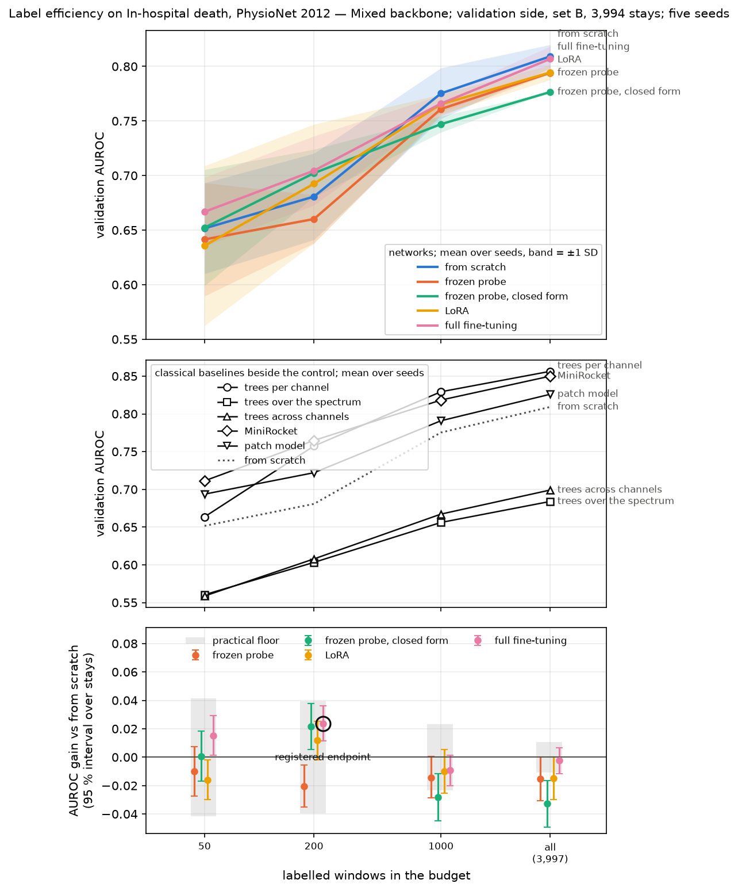
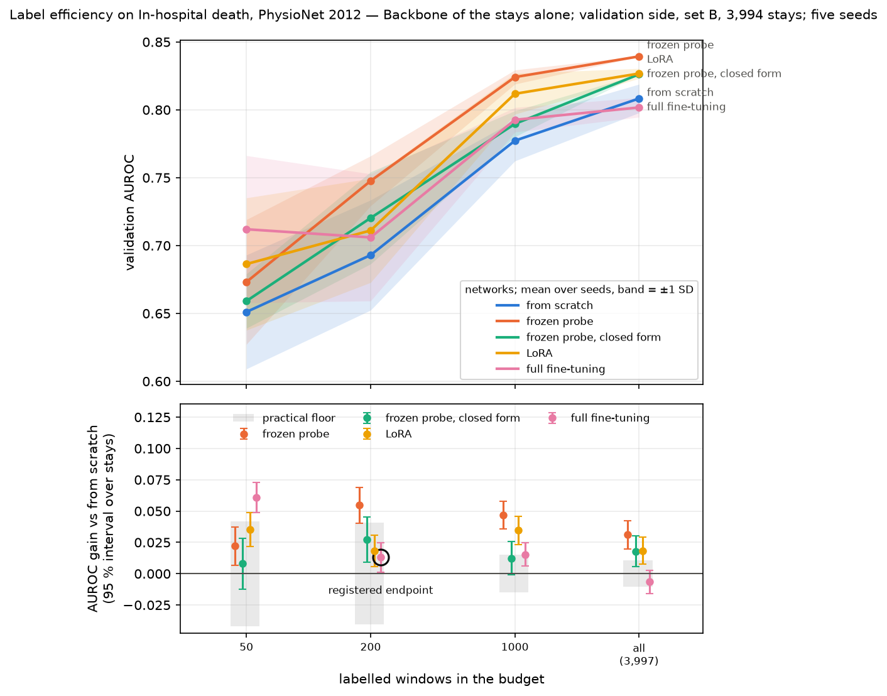

# Label-efficiency curve on the intensive-care task, preliminary and on the validation side

Purpose: read the label-efficiency claim on a second task, in-hospital death after a stay in
intensive care (PhysioNet/CinC Challenge 2012), by the rules registered before any of its numbers
existed (`docs/preregistration.md`, the intensive-care task). Sections are dated and appended.

**Every number here is validation, not test, and the result is preliminary.** The frozen side,
set C, is not opened.

## 2026-09-30 — both grids, Colab G4 under CUDA MPS and the M1 Pro

**Question.** Under the mixed backbone, does full fine-tuning at 200 labelled stays raise the
area under the ROC curve of the network trained from nothing by at least the registered least
gain, 0.045, with the whole interval above zero and above the floor? And what do the other ways
of using a backbone, the classical baselines and the patch model do at 50, 200, 1,000 and every
stay, under that backbone and under the backbone of the stays alone?

**Conditions.**

| | |
|---|---|
| Campaigns | `87cbc0e7…`, `campaigns/curve-physionet2012-mixed5.toml`, backbone `sha256:869ed545…`; `9129eabc…`, `campaigns/curve-physionet2012-stays.toml`, backbone `sha256:c5878c03…` |
| Code | orders placed at `933425fb` |
| Variants | each candidate at its selection's choice per budget, on the tuning side (`campaigns/selection-*-physionet2012.toml`, run 2026-09-29) |
| Sides | learnt from set A's stays, 50 to 3,997; scored on set B, 3,994 stays, 568 deaths, every cell |
| Seeds | 1 to 5 per cell; tier M |
| Rules | least gain 0.045, floor the larger of 0.01 and the control's SD over seeds, paired bootstrap over stays in two strata, 10,000 resamples, Holm over 35 and 15 |
| Machines | networks: one Colab G4, CUDA MPS, four processes, the longest order in 106 minutes; classical: MacBook Pro M1 Pro, CPU, 61 minutes |

    uv run scripts/campaign_report.py --campaign ID --out DIR --everything 3997
    uv run scripts/campaign_curve_figures.py DIR --figure PATH

**The endpoint**, at 200 stays:

| Backbone | From nothing | Full fine-tuning | Gain [95 % interval] | Floor | Verdict |
|---|---|---|---|---|---|
| mixed (the claim) | 0.681 | 0.704 | +0.024 [+0.012; +0.036] | 0.040 | distinguishable, practically nil: **not confirmed** |
| stays alone | 0.693 | 0.706 | +0.013 [+0.001; +0.025] | 0.041 | distinguishable, practically nil |

**Mean area over five seeds**, mixed backbone (the ways of using the stays-alone backbone in
brackets; its control is its own selection's variant):

| Candidate | 50 | 200 | 1,000 | all |
|---|---|---|---|---|
| from nothing (control) | 0.65 (0.65) | 0.68 (0.69) | 0.78 (0.78) | 0.81 (0.81) |
| frozen probe | 0.64 (0.67) | 0.66 (0.75) | 0.76 (0.82) | 0.79 (0.84) |
| probe in closed form | 0.65 (0.66) | 0.70 (0.72) | 0.75 (0.79) | 0.78 (0.83) |
| LoRA | 0.64 (0.69) | 0.69 (0.71) | 0.77 (0.81) | 0.79 (0.83) |
| full fine-tuning | 0.67 (0.71) | 0.70 (0.71) | 0.77 (0.79) | 0.81 (0.80) |
| trees per channel | 0.66 | 0.76 | 0.83 | 0.86 |
| trees over the spectrum | 0.56 | 0.60 | 0.66 | 0.68 |
| trees across channels | 0.56 | 0.61 | 0.67 | 0.70 |
| MiniRocket | 0.71 | 0.76 | 0.82 | 0.85 |
| patch model | 0.69 | 0.72 | 0.79 | 0.83 |

Under the mixed backbone 9 of 32 secondary comparisons are distinguishable, none of them a way of
using the backbone; under the stays alone 6 of 12, with the frozen probe above the floor at 200,
1,000 and every stay, LoRA at 1,000 and every stay, and the closed-form probe at every stay.

**Conclusions.**

1. The endpoint is not confirmed under either backbone. Full fine-tuning's gain at 200 is
   distinguishable from zero but below both the floor and the least gain. Under the mixed
   backbone it clears no floor at any budget; under the stays alone it clears the floor at 50
   and 1,000, with gains of 0.061 and 0.015, and not at every stay.
2. Under the mixed backbone no way of using it beats the network from nothing at any budget; the
   closed-form probe is worse at 1,000 and every stay. Under the stays alone the frozen probe
   gains 0.055, 0.047 and 0.031 in area at 200, 1,000 and every stay. The mixture, which learnt
   the stays about as well as eight epochs on them alone (`manual-handoff.md`, 2026-09-29), is
   the weaker backbone for this task. This comparison was named a diagnostic in the registration
   but given no prediction beforehand, so it is descriptive only.
3. From 200 stays up a classical baseline has the highest mean area of any candidate:
   MiniRocket at 200 (0.765), the trees per channel at 1,000 and every stay (0.829 and 0.856).
   The nearest network is the stays-alone probe, 0.824 at 1,000, above MiniRocket's 0.818. At
   50 the stays-alone full fine-tuning and MiniRocket are level, 0.712 and 0.711. The two
   campaigns are not paired against each other, so these are means, not tests. The patch
   model's mean is above every pretrained arm's at 50 and 200 under the mixed backbone.
4. One seed's area moves by about 0.04 at 200 stays; the floor at 200 is therefore 0.040 and
   0.041, above the gain of every pretrained arm but the stays-alone probe.

**Limitations.**

- Learnt from set A's 3,997 stays and scored on set B. Published benchmarks on this corpus
  (P12) usually learn from about 9,600 of 11,988 stays with other splits, and report 0.85–0.86
  for their best networks; the levels here are not comparable with them.
- Two possible handicaps of the networks, not measured: the selections of the network from
  nothing and of full fine-tuning chose the edge of their rate grid at several budgets (÷3 at
  1,000 and every stay, ×3 at 200 under the mixed backbone), so the best rate may lie beyond it;
  and the floor of 2,000 optimiser steps, 160 epochs at 200 stays and 640 at 50 with no early
  stop, was confirmed on the turbofans only. Both touch the control and the endpoint alike.
- The two campaigns' controls differ, each at its own selection's variant, so a cell of one is
  not the same cell of the other.
- Networks ran on a G4, the classical baselines on the M1 Pro's processor; every cell of one
  budget of one pool ran on one kind of machine.

## 2026-09-30 — the cost of laying stays on a grid

**Question.** MiniRocket and the patch model can only read a regular grid, so an irregular stay
is resampled for them. Does that cost them area against the network that reads the raw readings,
the one trained from nothing?

**Conditions.**

| | |
|---|---|
| Campaign | `87cbc0e7…`, mixed backbone, the section above; no new run |
| Grid | one step an hour, 49 steps over 48 hours and a minute (MiniRocket at every stay: two steps an hour, its selection's choice); a step with no reading carries the channel's last one forward, a channel not yet seen carries zero, the corpus mean; every channel doubled by a mask of the steps really observed; statics held at every step |
| Patch model | 192 wide, 4 blocks, patches of 8 steps at a stride of 4, dropout 0.2, mean pooling; rate 0.001, 0.003 at 1,000 |
| Network on raw readings | the backbone's shape, 256 wide, 6 blocks, dropout 0; mean pooling; rate 0.001 at 50, 0.003 at 200, 0.000333 at 1,000 and every stay |
| Schedule | both networks from nothing: 30 epochs of 16 stays and at least 2,000 steps |
| Rules | the registered secondary comparisons, paired over set B's 3,994 stays, Holm over 35 |

**Gain in area over the network on raw readings**, mean over five seeds:

| Stays | Raw readings | Patch model [95 % interval] | MiniRocket [95 % interval] |
|---|---|---|---|
| 50 | 0.652 | 0.694: +0.042 [+0.027; +0.057] | 0.711: +0.060 [+0.044; +0.075] |
| 200 | 0.681 | 0.722: +0.041 [+0.028; +0.055] | 0.765: +0.084 [+0.072; +0.097] |
| 1,000 | 0.775 | 0.791: +0.016 [+0.003; +0.028], n.s. | 0.818: +0.043 [+0.029; +0.057] |
| all | 0.809 | 0.826: +0.017 [+0.004; +0.029], n.s. | 0.850: +0.041 [+0.029; +0.053] |

n.s.: not distinguishable under the family's correction; every other cell is.

**Conclusions.**

1. Measured as the gap to the network on raw readings, the grid costs the methods that need it
   nothing: both lead that network at every budget, and six of the eight gains are
   distinguishable.
2. The patch model is the closer comparison: a transformer trained from nothing on the same
   schedule. It leads by about 0.04 at 50 and 200 stays and by under 0.02, not distinguishable,
   from 1,000 up.
3. The raw readings do not give the network an advantage at these budgets. Whether they cost it
   one is not settled here (limitations).

**Limitations.**

- The patch model differs from the network on raw readings in more than its input: it is
  narrower and shallower, reads patches of eight hours rather than single readings, and is
  regularised by dropout 0.2 against none. The gap is the cost of the whole design, not of the
  grid alone. Only the same network fed the gridded readings as tokens would isolate the grid.
- The mask tells the grid methods where a reading was made. The network on raw readings learns
  the same from which readings its tokens hold, so the mask gives the grid no information the
  other side lacks.
- One backbone's campaign; the stays-alone campaign holds no grid method.

## 2026-10-01 — declared before the run: the task at the size published results learn from

**Question.** The network trained from nothing reaches 0.81 in area at every stay of set A
(3,997 stays), while the trees per channel reach 0.856. The best published networks for in-hospital
death reach 0.83–0.86 learning from about 2,600 to 7,700 stays. Is the network's deficit a matter of
how many stays it learns from, or of the network and how it is trained?

**What the published results learn from**, read in each paper:

| Source | Stays learnt from | Scored on | Networks' area |
|---|---|---|---|
| Shukla and Marlin, ICLR 2021 (mTAN), Table 2 | about 2,560, set A | 20 % of set A | 0.76–0.86; mTAND-Enc 0.854 |
| Tipirneni and Reddy, TKDD 2022 (STraTS), Tables 4–5 | about 3,200: half of the 80 % of sets B and C it learns from | set A | 0.80–0.84; without its pretraining 0.835 |
| Horn et al., ICML 2020 (SeFT), Table 1 | about 7,700: 64 % of all three sets, by its appendix | about 2,400 | 0.79–0.86; GRU-D and Transformer 0.863 |
| Johnson and Mark, AMIA 2017, on the challenge's winner | set A, 4,000 | set C | trees in a Bayesian ensemble, 0.860 |

Each of the three papers on networks keeps the model of the best validation epoch. STraTS, the recurrent baselines it
runs and SeFT use dropout of 0.2 or more, and STraTS is 32 to 50 wide with two blocks, far
smaller than this project's backbone shape (256 wide, six blocks, no dropout).

**Design.** `campaigns/reproduction-physionet2012.toml`, campaign `af0cae4a…`, tier M. A version of
the corpus published from sets A and B with one stay in five held out by seed 1 (manifest
`sha256:d5d0947a…`): 6,400 stays to learn from, 1,600 to score on, normalisation fitted on the
6,400; stays, windows, tokens and channels are those of the version the grids read (manifest
`sha256:cef44de2…`), only the division and the statistics differ. Set C stays frozen. Three
candidates at every stay, at the variants their selections chose at every stay in the registered
grids: the network from nothing at a rate of 0.000333, the trees per channel, MiniRocket at two
steps an hour. Five seeds; the network's cells through an order on a Colab GPU, the classical
cells on the M1 Pro's processor. Read as means and paired intervals by
`scripts/campaign_report.py`; no verdict is drawn. Each candidate's description, its compute
budget included, is the one the mixed backbone's grid recorded. A first definition, `0cb127f5…`,
was made without the grids' worker settings and recorded MiniRocket's published penalties
rather than the registered fifteen; it was never ordered.

**Predictions.**

1. The trees per channel reach 0.86 or more, and MiniRocket within 0.01 of them.
2. If the network's deficit is the number of stays, it reaches 0.84 or more at 6,400, the level
   of published networks at 3,200 to 7,700 stays, and its gap to the trees is under 0.02.
3. If it is the network or its training, it stays below 0.83 and the gap to the trees stays near
   0.04, as at 3,997 stays.

The second outcome is expected less: mTAN reaches 0.85 from fewer stays than set A holds.

**Reading.** The second outcome points the remaining diagnostics at the size of the labelled
side; the third points them at the network: dropout, the gridded input and the floor of steps,
each declared before its own run. A result between the two is reported as such. No verdict of
the registered grids changes.

## 2026-10-01 — Colab G4 and the M1 Pro: the task at the size published results learn from

**Question.** The one declared above: at 6,400 stays from sets A and B, does the network trained
from nothing reach the level of published networks, so that its deficit at 3,997 stays is a matter
of size, or does it stay where it was?

**Conditions.**

| | |
|---|---|
| Campaign | `af0cae4a…`, `campaigns/reproduction-physionet2012.toml`; task over manifest `sha256:d5d0947a…` |
| Code | orders placed at `a6a777fd` |
| Sides | learnt from 6,400 stays of sets A and B; scored on the 1,599 of the other 1,600 that hold a window, 213 deaths |
| Seeds | 1 to 5; tier M; no verdict drawn |
| Machines | network: one Colab G4, 3.6 min a cell; classical: MacBook Pro M1 Pro, CPU, 7 s a cell for the trees, 23 min for MiniRocket |

    uv run scripts/campaign_report.py --campaign af0cae4a-1026-45a4-8d53-57a9e17f9e44 \
        --out DIR --everything 6400

**Area under the ROC curve**, mean ± SD over five seeds, and the paired gain over the network
(95 % interval, 10,000 resamples over stays):

| Candidate | Area | Gain over the network |
|---|---|---|
| network from nothing, rate 0.000333 | 0.799 ± 0.009 | — |
| trees per channel | 0.861 ± 0.000 | +0.062 [+0.043; +0.081] |
| MiniRocket, two steps an hour | 0.824 ± 0.003 | +0.025 [+0.006; +0.046] |

**The same candidates at 3,997 stays** (the mixed backbone's grid above, scored on set B; not
paired with this run): network 0.809, trees 0.856, MiniRocket 0.850.

**Conclusions.**

1. The third outcome declared holds: the network stays below 0.83 and trails the trees by 0.062,
   more than at 3,997 stays. The second, a deficit of size, is rejected.
2. Published networks reach 0.83–0.86 learning from 3,200 to 7,700 stays; this network reaches
   0.80 at 6,400. Its deficit lies in the network or how it is trained, which the remaining
   diagnostics take up: dropout, the gridded input and the floor of steps.
3. The trees per channel reach the level of the challenge's winner (0.860) from 4,000 stays and
   gain nothing measurable from 6,400; neither does the network.
4. The first prediction holds for the trees, not for MiniRocket: at 0.824 it is 0.037 below them
   and 0.026 below its own area at 3,997 stays, far beyond the spread of its seeds. Not explained
   here; its variant was selected on the smaller labelled side.

**Limitations.**

- Learnt and scored on a division of sets A and B that the registered grids do not use; 3,209 of
  the 6,400 stays are set B's, the registered grids' validation side. No model fitted here is used
  by them.
- The comparisons with 3,997 stays are across scored sides and not paired; a difference of 0.01
  between them is within what another scored side moves an area by.
- Each candidate runs at the variant selected at every stay of set A; nothing was selected again
  at 6,400 stays.
- 1,599 stays scored and 213 deaths: the paired intervals above are about ±0.02 wide.

## 2026-10-01 — declared before the run: dropout and the gridded input

**Question.** At 3,997 and 6,400 stays the network trained from nothing reaches about 0.80 in area,
where published networks reach 0.83–0.86 from 3,200 to 7,700 stays (the two sections above). Those
networks drop a fifth of their activations or more; this one drops none. The patch model, which
led it by 0.041 at 200 stays on the validation side, both drops a fifth and reads its readings on
a grid of one step an hour. Does the same network gain from either knob, and how much of the gap
does each close?

**Design.** Two campaigns on the registered task, each scored on the fifth of the tuning stays held
out by seed 101 for every seed, about 800 stays, the fifth the spread over seeds was read on; the
validation side is not read.

| | `campaigns/grid-cost-all-physionet2012.toml` | `campaigns/grid-cost-200-physionet2012.toml` |
|---|---|---|
| Campaign | `f8c5225b…` | `4e28a197…` |
| Stays learnt from | every tuning stay outside the fifth | 200 |
| Network's rate | 0.000333 | 0.003 |
| Seeds | 1 to 5 | 1 to 10 |

Five candidates in each: the network from nothing at the rate the registered grid ran it at that
budget; the same network fed the readings laid on one step an hour, a token per channel and step
from the channel's first reading on, its gap the time since a real reading; the same network under
a dropout of 0.2; the same network under both; the patch model at its registered setting. Each is
described in its campaign exactly as the registered grid describes it, the turned knobs aside. 50
stays are left out: one seed moves the area there by 0.057 on this fifth, so even ten seeds would
read a difference of two candidates only to about 0.03. A first definition, `d4d5e7a4…`, ran every
network at 0.001 and was never ordered: at every stay that rate is not the one the network's
selections chose, and a gain under dropout could then be a correction of the rate.

**Reading.** Each candidate against the network from nothing, by `scripts/campaign_pairs_report.py`:
the gain in area paired over the stays, two strata, 10,000 resamples, 95 % interval; and beside
it the gain seed by seed, each seed's two answers drawn from the same labels, with its mean and
standard error over the seeds. A knob *gains* where the interval lies above zero and the mean over
seeds exceeds twice its standard error; the interval alone cannot see how far another seed moves
either side. At 200 stays a knob *closes the patch model's lead* where it gains and its gain is at
least half the patch model's.

**Predictions.**

1. At every stay, the dropout gains at least 0.015, half the gap between this network and the
   published ones at a similar size.
2. At every stay and at 200, the grid alone moves the area by less than 0.01 either way: published
   networks reach the same level on hourly aggregates and on raw readings.
3. At both budgets, the two knobs together land within 0.01 of the dropout alone.
4. At 200 stays the patch model gains 0.02 or more, and the dropout closes its lead; at every stay
   the patch model's gain is under 0.02, as on the validation side.

**What follows.** If the dropout gains, the networks of the next backbones learn under a dropout a
selection chooses, and the gap that remains is read against the shape. If the grid gains, the
representation of irregular readings is reopened before any backbone is retrained. If neither
does, a narrower network from nothing is the next candidate. No verdict of the registered grids
changes.
