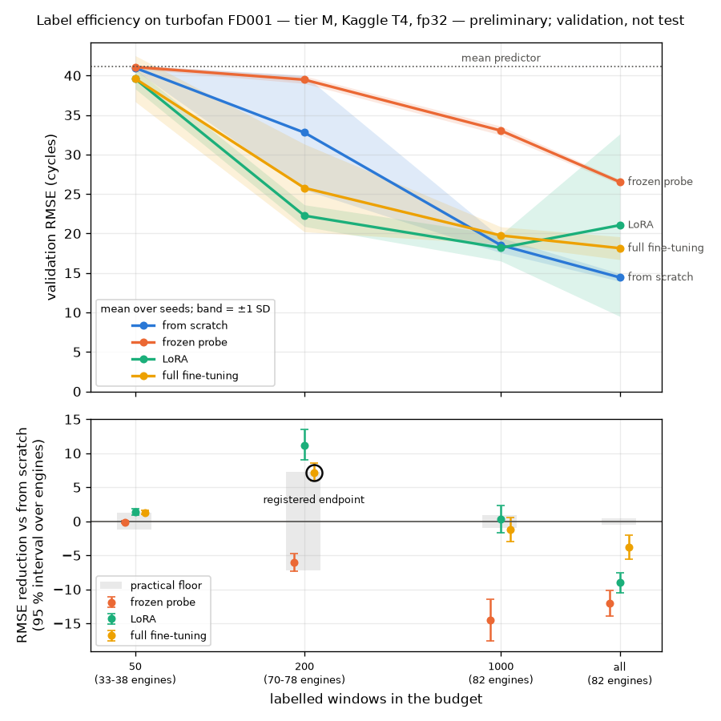

# Label-efficiency curve: the first reading, preliminary and on the validation side

Purpose: draw the curve the programme is about — four transfer modes over four budgets of
labels under five seeds, on the turbofan task, from the registered backbone — and read it by
the rules registered before any of its numbers existed (`docs/preregistration.md`). Two things
happen here in order: the schedule of every arm is fixed at one budget on the validation side,
recorded as an amendment to the preregistration before the grid; then the grid runs on the GPU
platform and is read through the Evaluation context's statistics (ADR-0032).

**Every number here is validation, not test, and the result is preliminary.** The frozen test
side of the task is never opened. The evaluation harness repeats this comparison once it
exists; the reading it makes is the one published, and the difference from this one is recorded
when it is known.

Method on a machine with the remote bucket's credentials and the downloaded corpus under
`data/raw` (the assertions the curve stands on are tests: `tests/evaluation`,
`tests/scripts/test_transfer_modes_report.py`, `tests/scripts/test_label_curve_report.py`):

```sh
uv sync --all-extras
uv run pytest tests/evaluation tests/scripts
# one cell, or a sweep of them, on this machine — the budget the machine's tier serves
uv run --env-file .env.r2 scripts/transfer_modes_report.py \
    --weights <key> <checksum> --manifest <key> <checksum> \
    --budget 200 --seed 1 --mode from_scratch --device mps --out data/report/transfer/<name>
# the grid, fetched back from the bucket, read and drawn
uv run --env-file .env.r2 scripts/transfer_modes_report.py --fetch <key> <checksum> --out <shard>
uv run scripts/label_curve_report.py <shard> [<shard> ...] --out data/report/curve/<name>
uv run scripts/label_curve_figures.py data/report/curve/<name> \
    --figure docs/verification/figures/label-efficiency-curve.png
```

The transfer report stores a grid cell by cell — a row per run, per epoch and per validation
window — skips the cells a directory already holds, and publishes a directory to the bucket as
one archive; the curve report reads the shards as one curve and writes the three files a note
and a figure are rendered from. Nothing here is computed from what is still in memory.

On the platform, the grid is two processes in one session, one per accelerator, sharded by
seed. The cell runs in one notebook cell that waits for both, and both log to the notebook's
own output, because a session run non-interactively ends when its last cell returns and its
working directory does not outlive it. The prefix is added unbuffered (`sed -u`): through a pipe
`sed` otherwise holds its output until a block fills, and the log falls silent for many cells
while the bucket already holds them:

```sh
git clone https://github.com/lstasiak/emblema && cd emblema && git checkout <commit>
pip install -e ".[ml]"                       # the scripts are not in the wheel
python scripts/fetch_corpora.py cmapss       # the ground truth is read from the raw files
# EMBLEMA_ARTIFACT_STORE__* from the notebook's secrets, as for the pretraining runs
python scripts/transfer_modes_report.py --weights ... --manifest ... \
    --seed 1 --seed 3 --seed 5 --device cuda:0 --out shard-0 --publish 2>&1 \
    | sed -u 's/^/[shard-0] /' &
python scripts/transfer_modes_report.py --weights ... --manifest ... \
    --seed 2 --seed 4 --device cuda:1 --out shard-1 --publish 2>&1 \
    | sed -u 's/^/[shard-1] /' &
wait
```

Every cell, once stored, is published as one archive and its reference printed on the cell's
own line, so a session that drops has lost at most the cell it was in; a cell that raises
stops its shard after publishing what it holds. A fresh session fetches each shard's last
reference into the same directory name and runs the same command: the cells it holds are
skipped, and a directory reopened under another plan, backbone or commit is refused rather
than resumed. The first cells of a shard are the cheapest budget, so a session reports its cost
per cell early.

```sh
python scripts/transfer_modes_report.py --fetch <key> <checksum> --out shard-0
```

## 2026-09-19 — Darwin arm64 (MacBook Pro M1 Pro, MPS, fp32): the schedule of every arm

Tree of the ticket branch on top of `6f5e9c3` (the code of the sweep is what the branch's
commits carry), Python 3.14.7, torch 2.14.0. Backbone `backbone-cmapss-m` (`de3815c9-…`,
weights `sha256:6830e117…`), corpus manifest `sha256:a00c3865…`. Task `turbofan-fd001`,
ceiling 125, 4 strata; 200 labelled windows drawn under seed 1, which reach 73 of the 82 tuning
engines; validation over the 18 held-out engines, 535 windows. Every arm: 30 epochs, batches of
16, no weight decay, run seed 1; the low-rank arm at rank 8, α = 16, beside `qkv`,
`attention.projection` and `feedforward`. Two shapes of the rate: constant, and a linear
warm-up over the first tenth of the run's steps followed by a cosine decay to one per cent of
the peak. The rule, fixed before the sweep: each arm takes the peak with the lowest validation
RMSE of three, and the shape chosen for the control arm applies to every arm. The sweep first
covered the control and the probe; when the control came out level with full fine-tuning, the
two remaining arms were swept over three peaks the same way (`docs/preregistration.md`,
2026-09-19). Stored under `data/report/transfer/sweep-20260919/<arm>-lr<peak>-<shape>`.

| arm | peak | shape | trainable | RMSE | seconds |
| --- | --- | --- | --- | --- | --- |
| from_scratch | 1e-3 | constant | 4,752,129 | 44.64 | 197 |
| from_scratch | 3e-4 | constant | 4,752,129 | 39.14 | 211 |
| from_scratch | 1e-4 | constant | 4,752,129 | 34.85 | 194 |
| from_scratch | 1e-3 | warm-up + cosine | 4,752,129 | 25.75 | 244 |
| **from_scratch** | **3e-4** | **warm-up + cosine** | 4,752,129 | **22.38** | 193 |
| from_scratch | 1e-4 | warm-up + cosine | 4,752,129 | 29.69 | 195 |
| frozen_probe | 1e-2 | constant | 257 | 38.92 | 10 |
| frozen_probe | 3e-3 | constant | 257 | 39.31 | 10 |
| frozen_probe | 1e-3 | constant | 257 | 40.08 | 10 |
| **frozen_probe** | **1e-2** | **warm-up + cosine** | 257 | **38.73** | 10 |
| frozen_probe | 3e-3 | warm-up + cosine | 257 | 40.14 | 10 |
| frozen_probe | 1e-3 | warm-up + cosine | 257 | 40.81 | 10 |
| **lora** | **3e-3** | **warm-up + cosine** | 196,865 | **20.70** | 237 |
| lora | 1e-3 | warm-up + cosine | 196,865 | 21.84 | 229 |
| lora | 3e-4 | warm-up + cosine | 196,865 | 22.90 | 231 |
| **full_fine_tuning** | **3e-4** | **warm-up + cosine** | 4,752,129 | **21.10** | 199 |
| full_fine_tuning | 1e-4 | warm-up + cosine | 4,752,129 | 22.08 | 321 |
| full_fine_tuning | 3e-5 | warm-up + cosine | 4,752,129 | 22.16 | 195 |

What the sweep says:

- **The constant rate reproduces the first run**: 44.64 at 1e-3, to the sixth decimal the
  number of `transfer-modes.md` (44.637796 there, 44.637797 here), so the schedule added to the
  loop is the identity where it says it is. The constant rate at 1e-4 repeats the diagnostic of
  that note as well (34.85).
- **The shape moves the control arm more than any peak does.** Under a constant rate the fresh
  encoder does best at the smallest peak and is still falling after thirty epochs; under the
  warm-up and the decay it does best at 3e-4 and its training loss settles (0.148 → 0.033 in
  units of the ceiling squared). The first run's control at the trivial predictor was the
  schedule's result.
- **The three arms that step the encoder, or an update beside it, end within two RMSE of one
  another** at this budget and seed: 22.38 from scratch, 21.10 with full fine-tuning, 20.70
  with the low-rank updates. The probe stays near the mean predictor (41.11 on these windows)
  whatever its rate, and the decay changes it by a fifth of a point.
- **Cost on MPS, fp32**: 190–245 s for an arm that steps the encoder at this budget, 10 s for
  the probe; the 321 s of one run is the machine doing something else at the time.

What it does not say: anything about the endpoint. One seed at one budget is a reading of the
schedule, not of the claim; the grid measures the claim over five seeds with its interval.

The path the grid takes was run once end to end on this machine the same evening, at the
smallest budget under one seed (`data/report/transfer/smoke-grid`): the four cells cost 54 / 7 /
64 / 53 s on MPS at 50 labelled windows from 33 engines (from scratch 41.11 — the mean
predictor's number —, probe 40.82, low-rank 40.78, full fine-tuning 34.81), the directory
published to the bucket as one archive (`durable/sha256/b7f62891…`), a second invocation
skipped every cell as already stored, the archive fetched back byte for byte, and the curve
report and the figure rendered from it, with the grid reported as incomplete and the endpoint
as not measured. Those numbers are a check of the path, not a reading of the curve; the one
secondary cell they reject, the probe at fifty, is rejected among the three cells that ran and
not among the registered eleven (`docs/preregistration.md`, the second section of 2026-09-19).

## 2026-09-20 — Linux x86_64 (Kaggle, two Tesla T4, fp32): the grid

Commit `0277f98` (the ticket branch rebased onto `86b0521`), Python 3.12, torch 2.10.0+cu128 as
preinstalled, package installed editable from the clone; the corpus fetched from its source of
record for the ground truth; the backbone and the manifest of the sweep. One session, two
processes sharded by seed, each cell published as it landed (80 archives, the last one of a
shard holding the whole shard): `cuda:0` seeds 1, 3, 5 — 48 cells, 7.53 h inside the cells,
finished 02:52 UTC; `cuda:1` seeds 2, 4 — 32 cells, 4.71 h, finished 00:02 UTC. Fetched here as
`data/report/transfer/grid-20260920/shard-{0,1}` (final references
`durable/sha256/e69ebef2…` and `durable/sha256/ad92964c…`), read into
`data/report/curve/grid-20260920` and drawn from there.

**Cost on a T4, fp32**: 41–45 / 4 / 42 / 41 s for the four arms at 50 labelled windows,
~150 s at 200, 740–770 s at 1,000 and 1,950–2,030 s at 2,651 for every arm that steps the
encoder or an update beside it — 0.37 to 0.41 s per optimiser step, the same whichever arm —
and 4 to 27 s for the probe. The first cells put the longer shard at seven hours, above the six
per accelerator at which the decision on half precision was to be reopened; the grid was left to
run because it fitted one session and the registration names single precision.

**The platform reproduces this machine.** Under seed 1 the four arms at 50 windows score
41.11 / 40.82 / 40.78 / 34.81, the smoke run's numbers to the second decimal, and at 200 they
score 22.38 / 38.73 / 20.69 / 21.02 against the sweep's 22.38 / 38.73 / 20.70 / 21.10 on MPS.

**Endpoint RMSE per cell, mean ± SD over seeds** (the engines column is how many engines the
budget's labels came from, over the seeds):

| budget | engines | from_scratch | frozen_probe | lora | full_fine_tuning |
| --- | --- | --- | --- | --- | --- |
| 50 | 33-38 | 40.97 ± 0.30 | 41.08 ± 0.25 | 39.58 ± 1.27 | 39.61 ± 2.91 |
| 200 | 70-78 | 32.78 ± 7.25 | 39.47 ± 0.47 | 22.26 ± 1.37 | 25.76 ± 5.56 |
| 1000 | 82 | 18.52 ± 0.96 | 33.03 ± 0.56 | 18.19 ± 1.67 | 19.75 ± 1.10 |
| all | 82 | 14.43 ± 0.48 | 26.52 ± 0.30 | 21.05 ± 11.54 | 18.14 ± 1.45 |

Trivial predictors over the same windows: mean predictor 41.11, ceiling predictor 66.85.

**Against the control arm**, pooled over the seeds, the interval a bootstrap over the 18
engines (10,000 resamples); the endpoint stands alone, the other eleven are the registered
family under the Holm correction at 5 %:

| mode | budget | control | candidate | reduction | relative | 95 % interval | p | floor | rejected | verdict |
| --- | --- | --- | --- | --- | --- | --- | --- | --- | --- | --- |
| frozen_probe | 50 | 40.97 | 41.08 | -0.11 | -0.3% | [-0.32, +0.08] | 0.2600 | 1.23 | no | indistinguishable |
| lora | 50 | 40.97 | 39.60 | +1.37 | +3.3% | [+0.86, +1.84] | 0.0002 | 1.23 | yes | distinguishable |
| full_fine_tuning | 50 | 40.97 | 39.69 | +1.28 | +3.1% | [+0.98, +1.56] | 0.0002 | 1.23 | yes | distinguishable |
| frozen_probe | 200 | 33.41 | 39.47 | -6.06 | -18.1% | [-7.34, -4.77] | 0.0002 | 7.25 | yes | worse |
| lora | 200 | 33.41 | 22.29 | +11.12 | +33.3% | [+9.07, +13.50] | 0.0002 | 7.25 | yes | distinguishable |
| full_fine_tuning | 200 | 33.41 | 26.24 | +7.17 | +21.5% | [+5.92, +8.57] | 0.0002 | 7.25 | primary | distinguishable, practically nil |
| frozen_probe | 1000 | 18.54 | 33.03 | -14.49 | -78.2% | [-17.56, -11.48] | 0.0002 | 0.96 | yes | worse |
| lora | 1000 | 18.54 | 18.25 | +0.29 | +1.6% | [-1.71, +2.28] | 0.7947 | 0.96 | no | indistinguishable |
| full_fine_tuning | 1000 | 18.54 | 19.77 | -1.23 | -6.6% | [-2.93, +0.55] | 0.1622 | 0.96 | no | indistinguishable |
| frozen_probe | all | 14.44 | 26.53 | -12.09 | -83.7% | [-13.97, -10.14] | 0.0002 | 0.48 | yes | worse |
| lora | all | 14.44 | 23.44 | -9.00 | -62.4% | [-10.48, -7.57] | 0.0002 | 0.48 | yes | worse |
| full_fine_tuning | all | 14.44 | 18.18 | -3.75 | -25.9% | [-5.57, -1.98] | 0.0002 | 0.48 | yes | worse |



**Verdict on the registered endpoint: not confirmed — distinguishable, practically nil.** Full
fine-tuning at 200 labelled windows takes 21.5 % off the control's error (7.17 RMSE, interval
[5.92, 8.57], five seeds pooled per engine), which clears the registered share and keeps the
whole interval above zero; the practical floor at that budget is 7.25, and 7.17 does not clear
it. The floor is the control's own spread over its five seeds, and that spread is the finding:

- **The control arm at 200 is bimodal.** Under seeds 1 and 5 it leaves the plateau of the mean
  predictor (22.4 and 28.1; training loss 0.033 and 0.046 in units of the ceiling squared) and
  under seeds 2, 3 and 4 it stays on it (36.2 to 39.0; loss 0.083 to 0.101, the variance of the
  target being 0.108). The sweep chose its peak under seed 1, one of the two seeds that escape.
- **The pretrained arm escapes more often, not further.** Four of its five repeats leave the
  plateau (21.0 to 25.8) and one stays (seed 2, 35.2, loss 0.087). Under seed 1, where both
  arms escaped, the difference is 22.38 against 21.02 — six per cent, under the registered ten.
  The endpoint's reduction is therefore mostly a difference in how often thirty epochs get an
  arm off the plateau, which is what the measured part of the floor exists to catch.
- Under the rules as they stood before the second amendment of 2026-09-19 the verdict would have
  read *confirmed*; the amendment binding the endpoint to the floor was registered before any
  cell ran, and this cell is the case it names.

**The budget of optimisation, a limit of this design.** Every arm trains for thirty epochs, so
the number of optimiser steps a cell gets grows with its budget of labels, and no cell of the
grid had converged when it was scored (the training losses per epoch are in each shard's
`epochs.csv`, in units of the ceiling squared; the variance of the target is 0.108):

| budget | optimiser steps | the training loss at the thirtieth epoch |
| --- | --- | --- |
| 50 | 120 | every arm on the plateau of the mean predictor: a loss of 0.09–0.11 and answers spread under 2.5 cycles in 17 of the 20 runs |
| 200 | 390 | the repeats that leave the plateau are still falling steeply (the control under seed 1: 0.072 → 0.051 → 0.033 over the last ten epochs); the others sit at 0.08–0.10 |
| 1,000 | 1,890 | every arm still falling (0.014–0.021) |
| all | 4,980 | every arm still falling (the control 0.011 → 0.009 over the last five epochs) |

The registration read the cell at fifty as a budget of optimisation before the grid ran; the
grid says the same of the cell at 200, where the decay to one per cent of the peak closes on
the repeats that start to leave the plateau late (the control under seed 4 drifts off 0.10 only
from the eighteenth epoch, with the rate already at half its peak and at a tenth by the
twenty-fifth, and ends at 0.083). What the low
budgets measure is therefore how fast an arm leaves the plateau under a fixed and small number
of steps, not how many labels the task needs; a budget stated in optimiser steps rather than
epochs, fixed before the next run, separates the two.

**The shape of the curve.**

- At 50 windows — 120 optimiser steps — every arm sits within 1.5 RMSE of the mean predictor;
  the two cells the family rejects there clear a floor of 1.23 by 0.05 and 0.14 RMSE. The
  amendment recorded this cell as a budget of optimisation before the grid ran.
- **The one secondary cell that clears its floor by a margin is the low-rank arm at 200**: all
  five of its repeats leave the plateau (20.7 to 23.9, 22.26 ± 1.37 over seeds) where the
  control's leave under two, and its reduction of 11.12 RMSE, interval [9.07, 13.50], clears
  the floor of 7.25 under the Holm correction. This is the ablation the transfer modes were
  framed as (ADR-0030): fewer degrees of freedom beside a pretrained encoder where labels are
  few. Read with the limit above: under seed 1, where the control leaves the plateau too, the
  two arms end at 22.38 and 20.70, so the cell's margin is mostly how reliably thirty epochs
  get an arm moving, and a longer budget of steps may close it.
- At 1,000 the three arms that step the encoder or an update beside it are indistinguishable
  (18.2 to 19.8).
- At every label the arm trained from scratch (14.4) is better than full fine-tuning (18.1) and
  than the low-rank updates (21.1), the whole interval of each below zero: the pretrained
  weights cost error where labels are plentiful, under the peaks chosen at 200. The two arms
  end at nearly the same training loss (0.010–0.015 against 0.008–0.012), and the pretrained
  one starts lower (0.047 against 0.112 after the first epoch), so the pretrained weights speed
  up the first epochs and then settle in a region that generalises worse to the held-out
  engines, in all five repeats.
- The probe is far below every other arm at every budget beyond the first (39.5 / 33.0 / 26.5
  against 25.8 / 19.8 / 18.1 for full fine-tuning): the mean of the encoder's states is not a
  linear summary of remaining life. This is the condition ADR-0030 named for a two-stage arm.
- **One repeat of the low-rank arm at the whole budget diverged late**: seed 1 scores 41.47
  where the other four score 13.4 to 18.1; its training loss fell to 0.033 by the tenth epoch
  and rose back to 0.110 by the last, under a peak of 3e-3 that was chosen over 390 steps and
  here ran 4,980. It is one repeat, reported and not dropped; the SD of 11.5 and the widened
  band of the figure are this run.

**Readings beside the endpoint**, mean ± SD over seeds — read, not thresholded:

RMSE below the ceiling:

| budget | engines | from_scratch | frozen_probe | lora | full_fine_tuning |
| --- | --- | --- | --- | --- | --- |
| 50 | 33-38 | 38.88 ± 0.96 | 39.43 ± 1.28 | 37.79 ± 1.34 | 37.97 ± 3.07 |
| 200 | 70-78 | 30.96 ± 6.86 | 37.48 ± 0.43 | 21.09 ± 1.10 | 24.51 ± 5.30 |
| 1000 | 82 | 18.35 ± 1.08 | 30.59 ± 1.22 | 17.46 ± 1.55 | 18.80 ± 1.13 |
| all | 82 | 14.74 ± 0.50 | 24.28 ± 0.69 | 20.55 ± 10.93 | 17.75 ± 1.39 |

RMSE on the last window of each engine (on the validation side an engine's last window ends within four cycles of its failure, so this is the error at the end of life; the benchmark's protocol, and the only reading comparable with published numbers, is the same over the test side's trajectories cut short of failure):

| budget | engines | from_scratch | frozen_probe | lora | full_fine_tuning |
| --- | --- | --- | --- | --- | --- |
| 50 | 33-38 | 73.62 ± 2.24 | 74.72 ± 2.95 | 71.01 ± 2.87 | 70.83 ± 8.11 |
| 200 | 70-78 | 50.61 ± 21.94 | 70.23 ± 1.15 | 10.49 ± 3.25 | 22.60 ± 22.21 |
| 1000 | 82 | 4.12 ± 0.75 | 51.82 ± 3.18 | 6.23 ± 1.72 | 6.62 ± 1.27 |
| all | 82 | 2.52 ± 0.47 | 32.34 ± 1.60 | 18.64 ± 32.24 | 4.93 ± 1.46 |

Alpha-lambda accuracy (share of answers within 20 % of the label):

| budget | engines | from_scratch | frozen_probe | lora | full_fine_tuning |
| --- | --- | --- | --- | --- | --- |
| 50 | 33-38 | 0.20 ± 0.00 | 0.21 ± 0.01 | 0.22 ± 0.01 | 0.22 ± 0.02 |
| 200 | 70-78 | 0.30 ± 0.10 | 0.21 ± 0.00 | 0.45 ± 0.02 | 0.39 ± 0.07 |
| 1000 | 82 | 0.58 ± 0.03 | 0.25 ± 0.01 | 0.55 ± 0.05 | 0.50 ± 0.02 |
| all | 82 | 0.67 ± 0.03 | 0.37 ± 0.01 | 0.54 ± 0.18 | 0.56 ± 0.04 |

Asymmetric score (mean per window, lower is better; its exponential tail is carried by a few engines):

| budget | engines | from_scratch | frozen_probe | lora | full_fine_tuning |
| --- | --- | --- | --- | --- | --- |
| 50 | 33-38 | 152.24 ± 29.72 | 170.96 ± 42.57 | 143.47 ± 34.16 | 144.76 ± 81.00 |
| 200 | 70-78 | 78.27 ± 60.02 | 119.76 ± 10.99 | 14.55 ± 4.50 | 39.54 ± 50.85 |
| 1000 | 82 | 8.67 ± 1.41 | 52.32 ± 14.66 | 8.41 ± 2.01 | 10.48 ± 1.56 |
| all | 82 | 4.15 ± 0.42 | 18.67 ± 2.24 | 41.77 ± 81.01 | 8.21 ± 1.78 |

The last-window reading is the error at the end of life on this side and is not comparable with
published test-side numbers (`docs/preregistration.md`, 2026-09-19). Two of them are worth a
sentence: at the whole budget the arm trained from scratch answers within 2.5 cycles at the end
of an engine's life and within a fifth of the label on two thirds of the windows, and at 200 the
low-rank arm carries the lowest asymmetric score of the grid (14.6 against 78.3 for the control).

**What the registered rules say to read next.** A negative result is read in a fixed order
before it is a statement about pretraining: the synthetic control (the transfer leg, not yet
run), whether the pretraining run was shown to have stopped learning (it was not: the backbone
spent 2,532 steps of batch 32 — four epochs, thirteen minutes on a T4 — and its validation loss
was still falling by seven per cent an epoch at the last one, `manual-handoff.md`; doubling the
budget of the same objective on the control corpora still cut the loss by a quarter or more,
`masked-reconstruction.md`; and the fine-tuning at the whole budget, 4,980 steps, spends more
compute than the pretraining did), and whether the control at this budget is already at the
floor of what the data support (it is not: two of its seeds reach 22 to 28 and at 1,000 it
reaches 18.5). The pretraining corpus is the tuning side of the task — the same 82 engines,
unlabelled — so at the whole budget the pretrained arm holds no data the control does not, and
the claim lives in the small budgets alone. What this grid establishes on its own is
that at 200 labelled windows the comparison is decided by which repeats leave the plateau under
thirty epochs, and that beyond 1,000 the pretrained weights are a cost. Whether the encoder
carries anything the task can use is what the synthetic control answers; the decision on the
next stage waits for it.

## 2026-09-20 — Linux x86_64 (Kaggle, two Tesla T4, fp32): the sweep under the floor

Code `605a5e0`, installed in the notebook from the commit: the floor of optimiser steps and the
head's start registered the same day (`docs/preregistration.md`, 2026-09-20), the platform's
torch 2.10.0+cu128. The same backbone, corpus, task and validation windows as the sweep of
2026-09-19: `backbone-cmapss-m` (`de3815c9-…`, weights `sha256:6830e117…`), manifest
`sha256:a00c3865…`, `turbofan-fd001`, the 18 held-out engines and their 535 windows. What
differs: 200 labelled windows drawn under three seeds, 1, 2 and 3 (73, 70 and 76 engines), and
every run lifted from thirty epochs to the floor of 2,000 steps — 154 epochs, 2,002 steps in
batches of 16, the warm-up over the first tenth and the cosine decay to one per cent spanning
the lengthened run, the head's bias starting at the mean label of the draw. The three peaks per
arm are the ones swept on 2026-09-19. The rule, fixed before the sweep: an arm takes the peak
with the lowest mean validation RMSE over the three seeds. The twelve configurations were dealt
by hand over the two accelerators, each published to the bucket as its own archive and fetched
back here into `data/report/transfer/sweep-20260920-kaggle/<arm>-lr<peak>` (archives
`durable/sha256/6354b176…`, `c02da1e2…`, `0b5d1461…` for the control at 1e-3, 3e-4, 1e-4;
`cedf1500…`, `20ae11f6…`, `93fa1aa1…` for the probe at 1e-2, 3e-3, 1e-3; `c0d5b199…`,
`3b2d8652…`, `be14e4b6…` for the low-rank arm at 3e-3, 1e-3, 3e-4; `0d81ba53…`, `95c90ea6…`,
`1c5360c5…` for full fine-tuning at 3e-4, 1e-4, 3e-5). Validation RMSE in cycles, the chosen
peaks in bold:

| arm | peak | trainable | seed 1 | seed 2 | seed 3 | mean | seconds |
| --- | --- | --- | --- | --- | --- | --- | --- |
| **from_scratch** | **1e-3** | 4,752,129 | 20.70 | 20.92 | 20.97 | **20.86** | 755–762 |
| from_scratch | 3e-4 | 4,752,129 | 23.39 | 21.06 | 21.28 | 21.91 | 760–763 |
| from_scratch | 1e-4 | 4,752,129 | 22.20 | 21.37 | 21.69 | 21.75 | 760–763 |
| **frozen_probe** | **1e-2** | 257 | 32.70 | 32.86 | 31.70 | **32.42** | 6–12 |
| frozen_probe | 3e-3 | 257 | 37.15 | 37.02 | 36.54 | 36.90 | 6–8 |
| frozen_probe | 1e-3 | 257 | 39.55 | 39.45 | 39.35 | 39.45 | 6–8 |
| lora | 3e-3 | 196,865 | 26.35 | 23.49 | 25.50 | 25.11 | 785–798 |
| lora | 1e-3 | 196,865 | 25.87 | 26.04 | 25.27 | 25.73 | 801–804 |
| **lora** | **3e-4** | 196,865 | 21.21 | 23.56 | 22.77 | **22.51** | 751–756 |
| full_fine_tuning | 3e-4 | 4,752,129 | 23.11 | 25.71 | 24.10 | 24.31 | 718–720 |
| full_fine_tuning | 1e-4 | 4,752,129 | 22.01 | 26.10 | 25.81 | 24.64 | 719–721 |
| **full_fine_tuning** | **3e-5** | 4,752,129 | 21.69 | 23.73 | 24.00 | **23.14** | 719–721 |

What the sweep says:

- **The control's peak moves up, to 1e-3, and its seeds agree.** Under 390 steps the same peak
  scored 25.75 and 3e-4 won; under 2,002 the order reverses, and the three seeds at 1e-3 lie
  within 0.27 of one another (SD 0.14). Every seed of every control peak leaves the plateau of
  the mean predictor (41.11 on these windows): the bimodality the grid was read under was a
  fact about 390 steps.
- **The peaks of the two arms that update the pretrained encoder move down a notch**: the
  low-rank updates from 3e-3 to 3e-4, full fine-tuning from 3e-4 to 3e-5, by 2.6 and 1.2 RMSE
  over the peak chosen at 390 steps. A run five times longer wants a smaller peak.
- **On this backbone, under the floor, the control is the best arm at 200**: 20.86 against
  22.51 with the low-rank updates, 23.14 with full fine-tuning and 32.42 for the probe, and
  the two pretrained arms spread nine times wider over the seeds (SD 1.2 and 1.3 against 0.14).
  This is a reading at one budget on the validation side, on a backbone that trained for
  2,532 steps with its validation loss still falling and is being trained again; the peaks of
  the three arms that start from it are swept again under the retrained one before any cell
  of the next grid. What it already says is that the first grid's reading at 200, a pretrained
  arm ahead of a control on the plateau, does not survive giving the control the steps to
  leave it.
- **The probe gains six points from the steps and is still limited by its rate**: 32.42 at
  1e-2 against 38.73 under thirty epochs, and monotone in the peak over the three swept, as
  it was on 2026-09-19.
- **Cost on a T4, fp32**: 0.36–0.40 s per optimiser step, 718–804 s per run for an arm that
  steps the encoder or an update beside it, 6–12 s for the probe; the twelve configurations
  took 3.3 h over the two accelerators.

What it does not say: anything about the endpoint, which the grid measures over five seeds
with its interval, or anything about the retrained backbone.

The same script ran the same twelve configurations on this machine (M1 Pro, MPS, fp32,
`data/report/transfer/sweep-20260920/<arm>-lr<peak>`) as the device check, the later
directories under `c333ab0`, a revision that leaves the adaptation untouched. As this is
written eight of the twelve have finished: the probe reproduces to the hundredth under every
peak and seed (32.70, 32.86, 31.70 at 1e-2), the control at 1e-4 as well (22.20, 21.37,
21.69), and the two higher peaks of the control and the low-rank arm at 3e-3 differ by a few
tenths to one and a half points per seed (control at 1e-3: 20.76, 22.35, 21.53 for a mean of
21.55 against 20.86; at 3e-4: 22.12 against 21.91; low-rank at 3e-3: 25.51 against 25.11). The
rule chooses 1e-3 for the control on either accelerator. The remaining four directories are
appended here when they finish.
