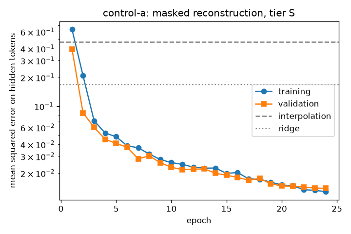
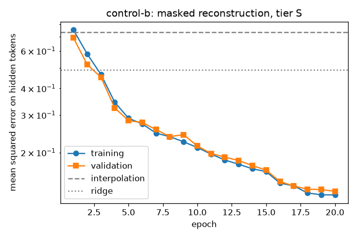
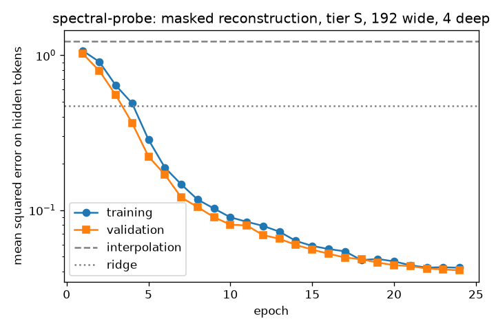
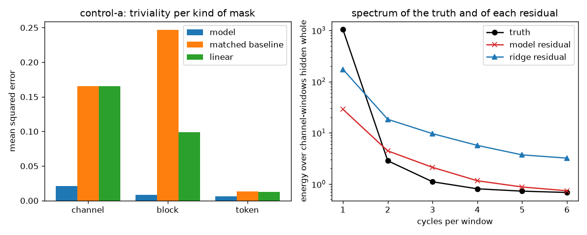
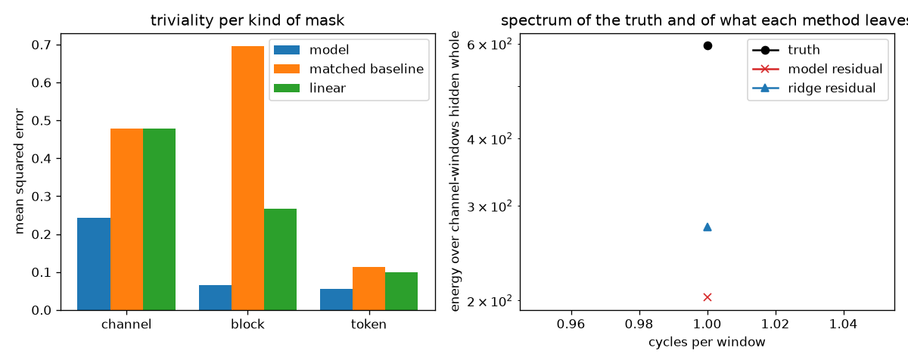
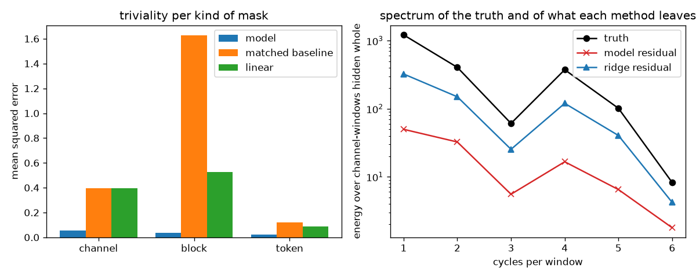
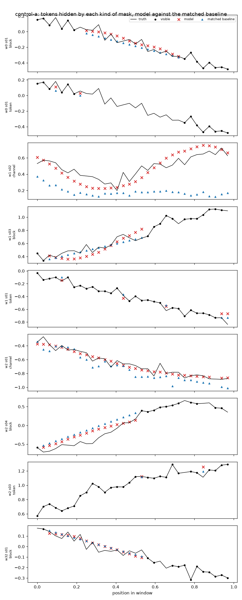
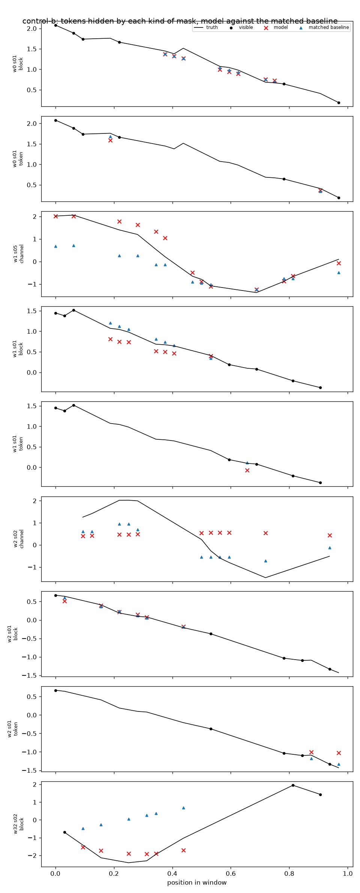
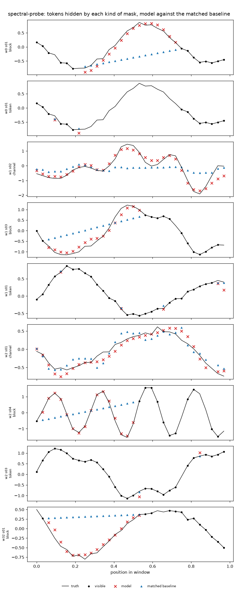

# Masked reconstruction on the synthetic control

Purpose: before the objective meets a real corpus, show on the positive control that its loss
falls, that its reconstructions follow the signal, and that what it learnt is not what a trivial
baseline already knew. The control exists for this: its shared structure was put there on purpose
(`synthetic-control.md`), so a model that finds nothing is at fault. The verdicts are code,
exercised from both sides in `tests/scripts/test_masked_reconstruction_report.py`; the one-batch
overfit, the single test that would catch a pipeline learning nothing, is
`tests/ml/test_objective_overfits_one_batch.py` and runs in the ordinary suite.

Every number here is measured on validation units. The test split of the control is untouched.

What is measured, on the validation units under masks drawn once per batch:

- **Loss** per epoch, training and validation, against the overall error of the two baselines
  over the same hidden tokens.
- **Triviality per kind of mask.** The baseline matched to each kind — linear interpolation within
  the channel for a block or a single token, a ridge regression from the other channels' nearest
  visible instants for a channel hidden whole — scored by the objective's own loss over the same
  tokens. A kind whose baseline does as well as the model taught nothing the baseline did not know.
  The timeless `gain` channel is tallied apart: it has no neighbours in time.
- **Spectrum of channels hidden whole.** A least-squares fit on whole cycles per window, with a
  constant and a trend, of the truth and of each method's residual; the share of the truth's energy
  each method gives back per frequency. Only frequencies at which the truth holds energy say
  anything — nothing recovers noise.

Known answers, written before the run (ADR-0019): the channels of the control are linear
projections of a few shared factors with a little noise, so a channel hidden whole should be
learnt (the model sees the whole window where the ridge sees one instant per channel), a block
should be learnt clearly (interpolation cannot see the other channels), and a single token between
two dense neighbours should be **trivial** on the dense layout — interpolation recovers it to
within the noise — and learnable on the sparse, irregular one, where the neighbours are farther.
The factors' periods are 24 to 300 steps and the window is 32, so the truth's energy should sit
at one cycle per window.

Method, on any machine with the repository:

```sh
uv sync --all-extras
uv run pytest tests/pretraining tests/ml/test_objective_overfits_one_batch.py tests/scripts/test_masked_reconstruction_report.py
uv run scripts/masked_reconstruction_report.py                       # tier S, every corpus
uv run scripts/masked_reconstruction_report.py --shape 64,2,2,256 --epochs 12 --learning-rate 3e-3   # what a CPU affords
```

Nothing is downloaded: the corpora are generated and published through the same use cases the
command line runs. The training loop is the report's own — plain Adam, no checkpoints, no tracker
— and is superseded by the training runtime, not extended.

The runs below are in the order they happened. The first leg is a small encoder on a CPU and the
answers it gave; the second is the published tier on Apple silicon, after the corrections the
first leg called for. What changed between them, and what did not, is the point of keeping both.

## 2026-09-13 — Windows AMD64, CPU, cut-down encoder — control-a

Tier S costs 2.5–3 s a step on this CPU, about 7 minutes an epoch of the full layout, so this leg
trains an encoder cut down to 64 wide and 2 blocks; the M1 leg trains the tier.

|  |  |
| --- | --- |
| Machine | Windows-11-10.0.26200-SP0, Intel64 Family 6 Model 140 Stepping 1, GenuineIntel |
| Python | 3.14.5 |
| torch | 2.14.0+cpu |
| Corpus | control-a, 4732 training and 1534 validation windows of 32 steps, stride 12 |
| Vocabulary | 9 channels, 1 apart |
| Encoder | tier S cut down to 64 wide, 2 deep: 64 wide, 2 heads, 2 blocks, 102,528 parameters; decoder of 1 block |
| Masking | channel 0.15, block 0.6 over 0.5 of the window, token 0.1; expected 46.5%, realised 46.0% of observed tokens |
| Training | 12 epochs, batch 32, Adam at 0.003, seed 1, CPU |

### Loss

| Epoch | Training | Validation | Seconds |
| --- | --- | --- | --- |
| 1 | 0.5693 | 0.3726 | 89 |
| 2 | 0.1812 | 0.0981 | 78 |
| 3 | 0.0858 | 0.0692 | 74 |
| 4 | 0.0560 | 0.0454 | 84 |
| 5 | 0.0471 | 0.0454 | 90 |
| 6 | 0.0458 | 0.0412 | 79 |
| 7 | 0.0417 | 0.0310 | 71 |
| 8 | 0.0366 | 0.0383 | 76 |
| 9 | 0.0335 | 0.0347 | 73 |
| 10 | 0.0323 | 0.0312 | 74 |
| 11 | 0.0335 | 0.0272 | 70 |
| 12 | 0.0314 | 0.0316 | 68 |

Validation loss went from 0.3726 to 0.0316 (÷11.8); over the same hidden tokens the interpolation baseline scores 0.4712 and the ridge baseline 0.2448.

### Triviality per kind of mask

| Kind | Baseline | Tokens | Model | Baseline error | Excess | Verdict |
| --- | --- | --- | --- | --- | --- | --- |
| channel | ridge | 56,902 | 0.0490 | 0.2439 | +0.1949 | learnt |
| block | interpolation | 97,141 | 0.0213 | 0.2467 | +0.2254 | learnt |
| token | interpolation | 23,145 | 0.0167 | 0.0135 | -0.0031 | trivial |
| channel (apart) | ridge | 338 | 1.0970 | 1.2837 | +0.1867 | learnt |

### Spectral recovery of channels hidden whole

| Cycles / window | Truth energy | Share | Model recovers | Ridge recovers |
| --- | --- | --- | --- | --- |
| 1 | 1.04e+03 | 99.4% | 0.94 | 0.81 |
| 2 | 2.85 | 0.3% | -2.06 | -7.97 |
| 3 | 1.11 | 0.1% | -2.16 | -11.55 |
| 4 | 0.808 | 0.1% | -1.11 | -8.53 |
| 5 | 0.727 | 0.1% | -0.44 | -5.83 |
| 6 | 0.685 | 0.1% | -0.14 | -5.30 |

1816 channel-windows fitted, 0 too short to fit. A share below zero means the residual holds more energy at that frequency than the truth does — where the truth holds next to none, that is the noise the model cannot recover.

### Verdict

- Loss fell: 0.3726 → 0.0316 on validation, an order of magnitude under either baseline's overall
  error, and still falling at the last epoch.
- `channel` masks: model 0.0490 against ridge 0.2439 — learnt, by five times. The ridge reads one
  instant per channel; the model reads the window.
- `block` masks: model 0.0213 against interpolation 0.2467 — learnt, by more than ten times.
- `token` masks: model 0.0167 against interpolation 0.0135 — **trivial**, as predicted: between two
  neighbours one step apart, a straight line recovers a smooth signal to within its noise, and a
  model is not asked to do better. This kind of mask teaches nothing here.
- Spectrum: the truth holds 99.4 % of its energy at one cycle per window, of which the model
  recovers 94 % and the ridge 81 %; the remaining 0.6 % is at the noise floor and no method
  recovers it. On this corpus the spectral diagnostic can only say that much — the control's
  factors are slower than the window, by design.
- Figures: not kept. A run writes them under the name of its corpus, so the tracked figures are
  the latest run's — the ones under the leg below.

## 2026-09-13 — Windows AMD64, CPU, cut-down encoder — control-b

|  |  |
| --- | --- |
| Machine | Windows-11-10.0.26200-SP0, Intel64 Family 6 Model 140 Stepping 1, GenuineIntel |
| Python | 3.14.5 |
| torch | 2.14.0+cpu |
| Corpus | control-b, 3354 training and 1132 validation windows of 32 steps, stride 12 |
| Vocabulary | 6 channels, 1 apart |
| Encoder | tier S cut down to 64 wide, 2 deep: 64 wide, 2 heads, 2 blocks, 102,336 parameters; decoder of 1 block |
| Masking | channel 0.15, block 0.6 over 0.5 of the window, token 0.1; expected 46.5%, realised 45.8% of observed tokens |
| Training | 12 epochs, batch 32, Adam at 0.003, seed 1, CPU |

### Loss

| Epoch | Training | Validation | Seconds |
| --- | --- | --- | --- |
| 1 | 0.7388 | 0.6283 | 12 |
| 2 | 0.5708 | 0.4920 | 12 |
| 3 | 0.4453 | 0.4508 | 13 |
| 4 | 0.3930 | 0.3860 | 14 |
| 5 | 0.3520 | 0.3511 | 14 |
| 6 | 0.3197 | 0.3204 | 14 |
| 7 | 0.2999 | 0.3002 | 13 |
| 8 | 0.2765 | 0.2891 | 13 |
| 9 | 0.2617 | 0.2517 | 15 |
| 10 | 0.2339 | 0.2269 | 19 |
| 11 | 0.2183 | 0.2280 | 13 |
| 12 | 0.2092 | 0.2132 | 13 |

Validation loss went from 0.6283 to 0.2132 (÷2.9); over the same hidden tokens the interpolation baseline scores 0.7342 and the ridge baseline 0.7572.

### Triviality per kind of mask

| Kind | Baseline | Tokens | Model | Baseline error | Excess | Verdict |
| --- | --- | --- | --- | --- | --- | --- |
| channel | ridge | 9,572 | 0.3583 | 0.7360 | +0.3778 | learnt |
| block | interpolation | 16,022 | 0.1367 | 0.6957 | +0.5591 | learnt |
| token | interpolation | 3,882 | 0.0982 | 0.1137 | +0.0156 | learnt |
| channel (apart) | ridge | 260 | 1.3019 | 1.3138 | +0.0118 | learnt |

### Spectral recovery of channels hidden whole

| Cycles / window | Truth energy | Share | Model recovers | Ridge recovers |
| --- | --- | --- | --- | --- |
| 1 | 595 | 100.0% | 0.61 | 0.23 |

785 channel-windows fitted, 65 too short to fit. A channel of this layout holds about a dozen tokens in a window, enough for one cycle.

### Verdict

- Loss fell: 0.6283 → 0.2132 on validation, under both baselines, and still falling steeply at the
  last epoch — twelve epochs of a small encoder do not exhaust this layout.
- `channel` masks: model 0.3583 against ridge 0.7360 — learnt. On five irregular channels the
  ridge has little to read; the model has the window.
- `block` masks: model 0.1367 against interpolation 0.6957 — learnt, by five times.
- `token` masks: model 0.0982 against interpolation 0.1137 — learnt, narrowly. Where neighbours are
  three steps apart and irregular, a straight line no longer recovers the signal to the noise, and
  the kind starts to teach something.
- Triviality diagnostic **negative** on this layout: every kind of mask beats its baseline.
- Spectrum: one cycle per window is all a dozen tokens can be fitted with; the model recovers
  61 % of the energy there against the ridge's 23 %.
- Figures: not kept, for the reason given under control-a.

### Reading of this leg

- The objective works: the loss falls an order of magnitude on the dense layout and threefold on
  the sparse one, to a fraction of what either trivial baseline scores overall, on both layouts of
  the control and with the same code path a real corpus will take.
- Two of the three kinds of mask are learnt on both layouts. The third — a single token hidden on
  its own — is trivial on the dense layout and barely learnt on the sparse one. That is the warning
  written down before the run, measured: single-token masking teaches interpolation. It stays in the mixture as the
  minority ingredient until the ablation of the mixture is run; the first dial that ablation turns
  is its rate, and zero is a candidate.
- The spectral diagnostic is uninformative on the control beyond one cycle per window, because the
  control's factors are slower than the window by design. It is in place for the corpora whose
  windows hold faster structure; on the control it confirms only that the model gives back the one
  component there is.
- Pending: the published tier on Apple silicon, and a comparison that says how far a verdict is
  from chance. An excess read off one number cannot tell a margin from noise; the next leg carries
  an interval per kind.

## 2026-09-14 — macOS arm64, MPS, tier S

### Provenance

| | |
| --- | --- |
| Machine | macOS-26.6.2-arm64-arm-64bit-Mach-O, Apple silicon, MPS |
| Python, torch | 3.14.7, 2.14.0 |
| Code | commit `e66f6ffa256701b765792725005ed75f6eb159a6`, clean checkout; the report's source digest `47315a129a26f36c` |
| Commands | `uv run scripts/masked_reconstruction_report.py --corpus control-a --corpus spectral-probe --epochs 12`, then `… --corpus control-b --epochs 10`, then `uv run scripts/masked_reconstruction_report.py` |
| Stored runs | `data/report/results/{control-a-20260914-211153, control-b-20260914-211323, spectral-probe-20260914-211659}`, compared with the half-budget runs `control-a-20260914-210150`, `control-b-20260914-210433` and `spectral-probe-20260914-210343` (local, not tracked) |

The first two commands train each corpus for half its default budget, so that the default run is
compared with a shorter run of the same code, as the convergence rule requires. The training does
not repeat bit for bit on MPS (see [Repeatability](#repeatability-on-mps)): every repeat so far gave
the same verdicts, with final losses up to 9% apart.

### Configuration

Common to every run: windows of 32 steps with a stride of 12; a quarter of the units held out for
validation; the tier S encoder (192 wide, 3 heads, 4 blocks, feed-forward 768) with a decoder of 1
block; masks hiding whole channels at 0.15, one block over half the window at 0.6 and single tokens
at 0.1, which hides 46.5% of observed tokens in expectation; Adam at a peak rate of 1e-3, one epoch
of warmup, cosine decay to 1% of the peak, batch 32, seed 1.

| Corpus | Layout | Windows (training / validation) | Validation units | Vocabulary | Epochs | Parameters |
| --- | --- | --- | --- | --- | --- | --- |
| control-a | dense, regular: 8 sensors on every step | 4,732 / 1,534 | 40 | 9, 1 apart | 24 | 1,787,136 |
| control-b | sparse, irregular: 5 sensors on their own schedules, noisier | 3,354 / 1,132 | 30 | 6, 1 apart | 20 | 1,786,560 |
| spectral-probe | control-a with factor periods of 6–32 steps instead of 24–300, 80 units | 2,363 / 783 | 20 | 9, 1 apart | 24 | 1,787,136 |

A channel "apart" is timeless or constant: it is tallied in a row of its own and never judged.

### Loss

| Corpus | Validation loss, epoch 1 → last | Interpolation | Ridge | Hidden share (expected 46.5%) |
| --- | --- | --- | --- | --- |
| control-a | 0.3949 → 0.0139 (÷28.4) | 0.4712 | 0.1693 | 46.0% |
| control-b | 0.6912 → 0.1314 (÷5.3) | 0.7342 | 0.4893 | 45.8% |
| spectral-probe | 1.0199 → 0.0409 (÷25.0) | 1.2289 | 0.4701 | 45.7% |

Losses are mean squared errors on hidden tokens in normalised units. The baselines are scored over
the same hidden tokens as the model. The validation loss ends within 0.1% of its best epoch on all
three corpora, and at 0.97–1.08× the training loss.





### Triviality per kind of mask

Each kind is judged against the baseline matched to it (interpolation within the channel
for blocks and single tokens, ridge regression from the other channels for a channel hidden whole).
Blocks and single tokens are also judged against the strongest linear baseline on the same sources
(the channel's own line and the other channels together). An interval is a 95% bootstrap over
validation units, under one draw of the masks, of the baseline's error minus the model's. A kind is
`learnt` only when the whole interval lies above zero. The rules, their thresholds and why each was
set where it is are in ADR-0020.

| Corpus | Kind | Tokens / units | Model | Matched baseline | Excess [95%] | Beyond linear [95%] | Noise floor |
| --- | --- | --- | --- | --- | --- | --- | --- |
| control-a | channel | 56,902 / 40 | 0.0209 | ridge 0.1656 | [+0.1248, +0.1660] learnt | — | 0.0025 |
| control-a | block | 97,141 / 40 | 0.0081 | interpolation 0.2467 | [+0.1982, +0.2793] learnt | [+0.0780, +0.1046] learnt | 0.0025 |
| control-a | token | 23,145 / 40 | 0.0060 | interpolation 0.0135 | [+0.0044, +0.0113] learnt | [+0.0041, +0.0103] learnt | 0.0025 |
| control-b | channel | 9,572 / 30 | 0.2435 | ridge 0.4774 | [+0.2000, +0.2710] learnt | — | 0.0061 |
| control-b | block | 16,022 / 30 | 0.0651 | interpolation 0.6957 | [+0.5403, +0.7236] learnt | [+0.1785, +0.2303] learnt | 0.0061 |
| control-b | token | 3,882 / 30 | 0.0560 | interpolation 0.1137 | [+0.0452, +0.0702] learnt | [+0.0363, +0.0494] learnt | 0.0061 |
| spectral-probe | channel | 28,286 / 20 | 0.0561 | ridge 0.3964 | [+0.2906, +0.3907] learnt | — | 0.0025 |
| spectral-probe | block | 49,884 / 20 | 0.0352 | interpolation 1.6275 | [+1.3606, +1.8388] learnt | [+0.4099, +0.5800] learnt | 0.0025 |
| spectral-probe | token | 11,768 / 20 | 0.0206 | interpolation 0.1191 | [+0.0755, +0.1225] learnt | [+0.0542, +0.0848] learnt | 0.0025 |

**The triviality diagnostic is negative on all three corpora.** Every kind beats its matched baseline
and, where it applies, the linear one. No model error falls below the noise floor, which would point
to a leak (the lowest is 2.4× the floor). Every matched baseline leaves room above the floor (the
lowest is 5.5×, token masks on control-a). The kind closest to trivial is single tokens on
control-a, where the lower bound beyond linear is +0.0041.

**This overturns one of the answers written before the runs.** Single tokens on the dense
layout were expected to be trivial, and were trivial in the first leg. They are not trivial
here. Three things differ: the tier S encoder against one cut to 64 wide and 2 blocks, 24
epochs against 12, and a warmed-up, decayed learning rate against a constant one. Which of
the three did it is not measured, so the honest statement is that the prediction held at the
capacity and budget it was made for and does not hold at this one. The margin is the
narrowest on the page, and the rate of this kind of mask remains the first dial an ablation
of the mixture turns.

The assessment accepts all three runs. Two warnings stand:

- **Convergence is not shown.** Doubling the budget from half still lowered the final validation
  loss by 28.3% (control-a), 28.9% (control-b) and 43.0% (spectral-probe), above the 5% the rule
  calls convergence, although no verdict changed.
- **The spectrum is uninformative on the controls.** See below.




### Spectral recovery of channels hidden whole

On the controls the truth holds 99.4% (control-a) and 100% (control-b) of its energy at one cycle
per window. Every higher frequency holds noise alone, so the diagnostic cannot tell a model that
learnt smoothness from one that learnt structure. The spectral probe is there to answer that
question:

| Cycles / window | Share of the truth's energy | Model recovers | Ridge recovers |
| --- | --- | --- | --- |
| 1 | 56.1% | 96% | 73% |
| 2 | 18.7% | 92% | 63% |
| 3 | 2.8% | 91% | 58% |
| 4 | 17.3% | 96% | 68% |
| 5 | 4.7% | 94% | 60% |
| 6 | 0.4% (below the 1% counted as signal) | 78% | 49% |

Fitted over 901 channel-windows, 1 too short to fit. The model recovers at least 91% of the energy
at every frequency that carries signal, so it does not recover only the low frequencies.



### Reconstructions

One channel per kind of mask from the first validation windows: truth as a line, visible tokens as
dots, the model's predictions (red crosses) and the matched baseline's (blue triangles) on the
tokens that kind hid.

- **spectral-probe.** Inside hidden blocks the model follows the oscillation through several cycles
  where interpolation draws a straight line (`w2 s04`, `w32 s01`). On channels hidden whole it keeps
  the shape and underestimates the peaks (`w1 s02`).
- **control-a.** Predictions follow the trend of the truth and leave out the step-to-step wiggles,
  which the spectrum puts at the noise level. Against interpolation inside blocks, the margin is
  clear on `w2 s04` and small on `w0 s01`. On a channel hidden whole (`w1 s02`), the model follows
  the shape with too much amplitude: below the truth in the first half and above it in the second.
  The ridge baseline stays flat there.
- **control-b**, the sparse and noisy layout, is the weakest. Blocks mostly follow the truth, some
  a little below it (`w1 s01`). One channel hidden whole is recovered in shape (`w1 s05`), another is
  not (`w2 s02`, where the model stays near +0.5 while the truth swings from +2 to −1.4). This agrees
  with control-b's highest channel error (0.2435, 40× the floor).

The reconstructions are sensible, not exact.





### Training budget

The default epochs in `scripts/masked_reconstruction_epochs.toml` are measured for what the report
decides. For each corpus, the entry E is the fewest epochs for which runs of E/2, E and 2E give
every kind of mask the same verdict against both baselines. The budget was measured before
`e66f6ff`, with the report's source digests `e859c97fb13c8352` (controls) and `7d26d7c38c24c6b7`
(spectral probe):

| Corpus | Epochs | Final validation loss | Token masks, matched | Token masks beyond linear, lower bound |
| --- | --- | --- | --- | --- |
| control-a | 6 / 12 / **24** / 48 | 0.0295 / 0.0194 / 0.0142 / 0.0114 | matched / learnt / learnt / learnt | −0.0044 / +0.0011 / +0.0041 / +0.0054 |
| control-b | 10 / **20** / 40 / 80 | 0.1865 / 0.1329 / 0.1008 / 0.0774 | learnt at every budget | +0.0049 / +0.0342 / +0.0497 / +0.0683 |
| spectral-probe | 6 / 12 / **24** / 48 | 0.2930 / 0.0717 / 0.0409 / 0.0250 | beaten / learnt / learnt / learnt | −0.1576 / +0.0394 / +0.0542 / +0.0611 |

- On the controls, channel and block masks were learnt at every budget.
- On the spectral probe at 6 epochs, channel masks were `matched`; from 12 epochs every kind was
  learnt.
- The loss had not converged at any budget. Each doubling lowered it by 20–34% on control-a, 23–29%
  on control-b and 39–76% on the spectral probe. A run at the default epochs therefore keeps the
  convergence warning, and the warning is true.

At `e66f6ff`, the E/2 and E runs give the same verdicts as the table: every kind learnt at both
budgets on all three corpora. The lower bounds for token masks beyond linear are +0.0011 and
+0.0041 on control-a, +0.0051 and +0.0363 on control-b, and +0.0394 and +0.0542 on the spectral
probe.

### Repeatability on MPS

Runs of one configuration do not always end at the same loss. The first two rows repeat one source
digest. The rest compare the runs just before and just after the assessment moved into the package
(`7d26d7c38c24c6b7`, then `47315a129a26f36c` at `e66f6ff`). That move changed where the rules live,
not what trains or what is scored; replaying the 23 runs stored before it through the moved code
reproduced every printed assessment byte for byte.

| Corpus, epochs | Source digests | Final validation loss | Channel masks, matched excess [95%] |
| --- | --- | --- | --- |
| control-a, 24 | `e859c97` twice | 0.01420 and 0.01382 (2.7% apart) | [+0.1235, +0.1652] and [+0.1251, +0.1665] |
| control-b, 20 | `e859c97` twice | 0.1329 and 0.1446 (8.9% apart) | [+0.2054, +0.2761] and [+0.1577, +0.2298] |
| control-a, 12 | `7d26d7c` → `47315a1` | 0.019404 and 0.019404 | [+0.1146, +0.1563] both |
| control-a, 24 | `7d26d7c` → `47315a1` | 0.01374 and 0.01391 (1.2% apart) | [+0.1254, +0.1667] and [+0.1248, +0.1660] |
| control-b, 10 | `7d26d7c` → `47315a1` | 0.1870 and 0.1849 (1.1% apart) | [+0.1075, +0.1747] and [+0.1117, +0.1798] |
| control-b, 20 | `7d26d7c` → `47315a1` | 0.1362 and 0.1314 (3.6% apart) | [+0.1993, +0.2706] and [+0.2000, +0.2710] |
| spectral-probe, 12 and 24 | `7d26d7c` → `47315a1` | 0.071725 and 0.040858, both times | identical |

No verdict differed between any of these runs. A verdict whose interval barely clears zero may still
not survive a repeat, which is why each default sits one doubling past the first budget that was
learnt. The cause of the spread has not been isolated.

### Limitations

- Synthetic control only, one pretraining seed, one draw of the validation masks. The intervals hold
  the variation between units under that draw, not the variation between draws or seeds.
- Validation numbers at tier S on one machine; MPS repeats differ by up to 9% in final loss.
- Convergence is not shown at the default budgets.
- The ridge penalty is a fixed 1.0, chosen rather than tuned, so the linear baselines are not the
  strongest linear answers obtainable on these inputs — only the strongest on this parametrisation.
  Their margins of defeat are five- to fortyfold, so a sweep would have to change them a great deal
  to move a verdict.
- The intervals are percentile bootstrap intervals over 20 to 40 units, which is approximate at
  that count.
- The training loop is the report's minimal one: no checkpoints, no experiment tracker and no
  precision policy. The training runtime replaces it.
